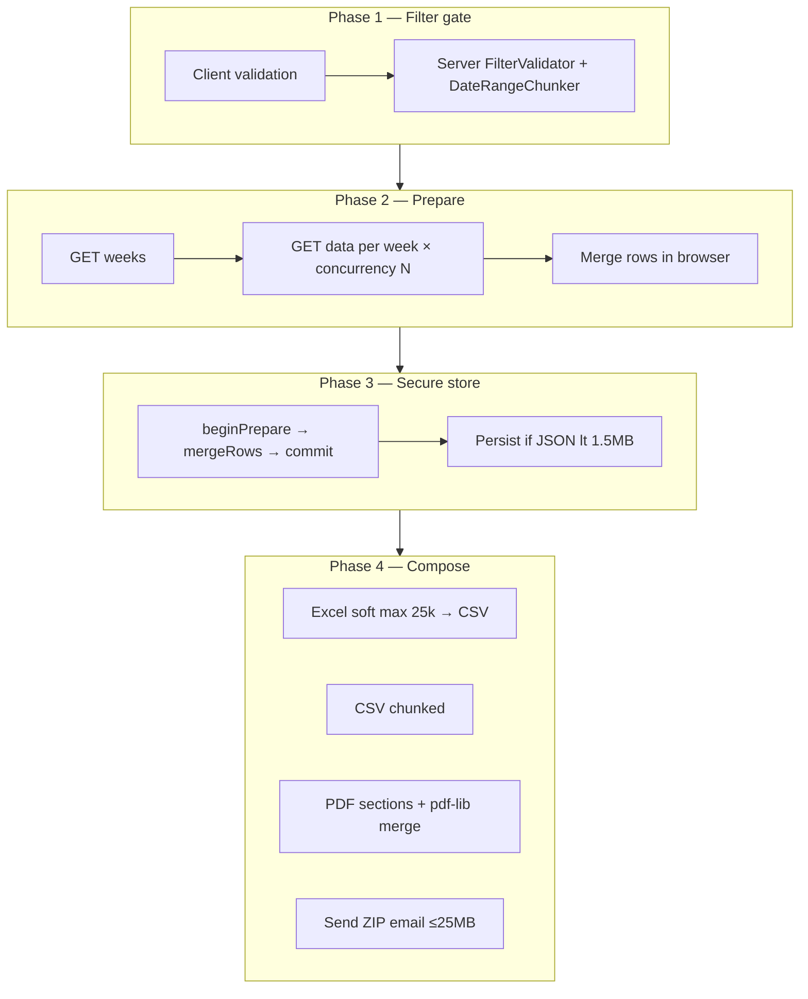
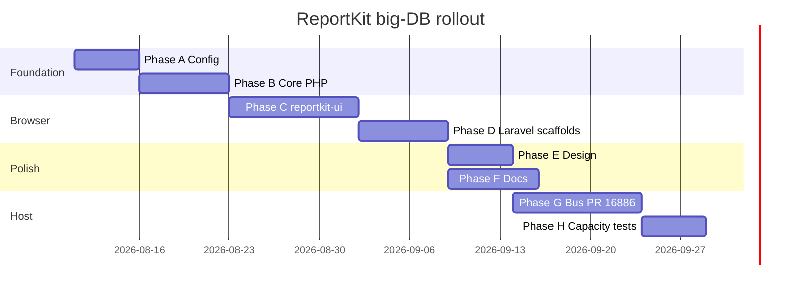

# ReportKit — Big-database execution plan

**Status:** active (2026-08-10)  
**Goal:** Make ReportKit packages fully support the **prepare-once → secure store → compose** workflow proven in Shohoz **Export Report**, driven by **config/settings** — not hard-coded host logic.

**Reference implementation (host):** [Shohoz bus PR #16886](https://dev.azure.com/Shohoz/ticket/_git/bus/pullrequest/16886) · process spec `Documents/common-report-generation.md` (bus repo) · acceptance `ExportReportCornerCaseTest` (29 tests · 287k PDF rows · 6-month live fetch).

**Package monorepo:** [Maijied/Reportkit-Core](https://github.com/Maijied/Reportkit-Core) · live demo [reportkit.lorapok.tech](https://reportkit.lorapok.tech).

---

## Executive summary

Shohoz Export Report already proves the big-database pattern on **Laravel 4.1 + RDS**:

| Phase | What happens | Re-query DB on export? |
|-------|----------------|------------------------|
| 1 Filter gate | Company, dates (≤6 months), enums validated client + server | — |
| 2 Prepare | Week chunks, concurrency **3**, merge rows in browser | Per week only |
| 3 Secure store | Encrypted `sessionStorage` if &lt; ~1.5MB else memory-only | **No** |
| 4 Compose | Excel / CSV / PDF / Send email from stored rows | **No** |

Today that logic lives in **bus `CommonServices` + `report-prepare.js`**, not in Packagist packages. ReportKit monorepo has **core primitives** and a **demo scaffold**, but not the full config-driven kit.

This plan migrates the proven process into **`reportkit/core`**, **`reportkit-ui`**, and **Laravel adapters**, then wires **bus** through packages (path repos → Packagist) without pushing package source to Azure.

---

## Process map (source of truth)



**Proven ceilings** (must become configurable defaults + docs):

| Setting | Export Report value | Config key (proposed) |
|---------|---------------------|------------------------|
| Max date span | 6 months | `date.max_months` |
| Week concurrency | 3 | `prepare.concurrency` |
| Session persist max | ~1.5MB plaintext JSON | `store.session_persist_max_bytes` |
| Excel soft max rows | 25,000 → CSV fallback | `export.excel_soft_max_rows` |
| PDF single-pass max | 105,303 rows | `export.pdf_single_pass_max_rows` |
| PDF proven max | 287,484 rows · 8,997 pages | documented benchmark |
| CSV chunk size | 400 | `export.csv_chunk_rows` |
| Mail attachment max | 25MB | `mail.hard_attach_max_bytes` |
| Long-running PHP memory | 2048M | `export.memory_limit` |

---

## Gap analysis (bus vs packages)

| Capability | Bus today | ReportKit monorepo |
|------------|-----------|-------------------|
| `ReportDateRangeService` | `CommonServices/` | `DateRangeChunker` ✓ |
| `ReportFilterValidator` | `CommonServices/` | `FilterValidator` ✓ |
| `ReportExportHelper` | `CommonServices/` | `ExportHelper` ✓ (partial) |
| `ReportMailService` | `CommonServices/` | **Missing** |
| `createPrepareRunner` | `report-prepare.js` | **Missing** in `reportkit-ui` |
| `createSecurePreparedStore` | `report-prepare.js` | **Missing** |
| PDF header / watermark / merge | `report-prepare.js` | **Missing** |
| Send Report pipeline | Blade + controller + mail | **Missing** adapter |
| Capacity constants | hard-coded in blade/JS/tests | **Not in config** |
| Feature flags per report | Export Report ad hoc | `Report::define` flags ✓ (partial) |
| CAS design / loader partials | `_partials/common-report/*` | `reportkit::` views ✓ (partial) |
| Demo hybrid report | `DemoReport*` scaffold | smoke only, no real SQL |
| Corner-case test suite | `ExportReportCornerCaseTest` | core unit tests only |
| Settings / brand | mixed PHP + JS | `config/reportkit.php` minimal |

---

## Phase A — Config & settings architecture

**Outcome:** One settings surface for host + package; no magic numbers in Blade/JS.

### A1. Expand `config/reportkit.php` (both Laravel adapters)

```php
return [
    'brand' => [ /* name, accent, pdf_disclaimer, logo_path */ ],
    'date' => [ 'max_months' => 6, 'block_future_dates' => false ],
    'prepare' => [ 'concurrency' => 3, 'day_label_under_days' => 7 ],
    'store' => [ 'session_persist_max_bytes' => 1500000, 'storage_key_prefix' => 'reportkit_' ],
    'export' => [
        'excel_soft_max_rows' => 25000,
        'pdf_single_pass_max_rows' => 105303,
        'pdf_chunk_rows' => 80,
        'csv_chunk_rows' => 400,
        'memory_limit' => '2048M',
    ],
    'mail' => [
        'enabled' => true,
        'hard_attach_max_bytes' => 26214400,
        'email_max_length' => 254,
        'view' => 'reportkit::emails.send',
    ],
    'notifications' => [ 'ping_enabled' => true, 'sound_muted_key' => 'reportkit_sound_muted' ],
    'features' => [ /* default flags for reportkit:make presets */ ],
];
```

### A2. Wire `SettingsStore` (core)

- [ ] Map config → `ArraySettingsStore` at boot
- [ ] Publish `reportkit.settings` JSON endpoint for browser (brand + ceilings only, no secrets)
- [ ] Document every key in `reportkit-core/docs/CONFIGURATION.md`

### A3. Definition-level overrides

- [ ] Allow `Report::define(...)->settings([...])` to merge report-specific ceilings
- [ ] Disabled feature flags omit routes, buttons, and JS bundles

**Exit:** Changing Excel/PDF limits requires config only; site docs list all keys.

---

## Phase B — Core PHP parity

**Outcome:** Host apps delete duplicated `CommonServices` report classes.

| Task | Package | Notes |
|------|---------|-------|
| B1 Port mail sender | `reportkit/core` or `reportkit/laravel-legacy` | ZIP-of-CSV, validation stack from `ReportMailService` |
| B2 Extend `ExportHelper` | `reportkit/core` | Filenames, summary matrix, `prepareLongRunningReport` |
| B3 Multi-database row source | `reportkit/core` | Already have `MergedRowSource`; document host wiring |
| B4 Error contract | `reportkit/core` | `{ error: string }` only; never MessageBag |
| B5 Port unit tests | `reportkit-core/tests` | From `ReportDateRangeServiceTest`, `ReportFilterValidatorTest`, `ReportExportHelperTest` |

**Exit:** Bus can `use ReportKit\Core\...` instead of `App\Services\CommonServices\Report*`.

---

## Phase C — Browser kit (`reportkit-ui`)

**Outcome:** `report-prepare.js` capabilities live in `@lorapok-labs/reportkit-ui`, configured from published settings.

| Module | Source (bus) | Target API |
|--------|--------------|------------|
| C1 Prepare runner | `createPrepareRunner` | `ReportKit.prepare.createRunner(opts)` |
| C2 Secure store | `createSecurePreparedStore` | `ReportKit.store.create({ storageKey, maxBytes })` |
| C3 Compose | Excel/CSV/PDF builders | `ReportKit.export.{excel,csv,pdf}(rows, opts)` |
| C4 PDF | header, watermark, merge | `ReportKit.pdf.*` |
| C5 Mail client | Send panel helpers | `ReportKit.mail.buildZip`, `assessEmail` |
| C6 UX | ETA, chunk processing, mute/ping | `ReportKit.ui.*` |
| C7 Aliases | `ShohozCommonReport` | keep `window.ReportKit`; bus alias during migration |

**Exit:** Export Report blade includes one JS bundle + settings JSON; no forked `public/js/common-report/`.

---

## Phase D — Laravel adapter & scaffolds

**Outcome:** `reportkit:make` generates a **production-grade** hybrid report matching Export Report wiring.

| Task | Adapter |
|------|---------|
| D1 Preset `hybrid-export` | weeks + data + send routes, prepare JS stub |
| D2 Preset `datatables-sync` | classic sync report |
| D3 Mail route + controller trait | `postReportSend` pattern |
| D4 Blade partials | loader, action buttons, filter fields, send panel, how-to |
| D5 Publish assets command | copy UI + inject config script |
| D6 `reportkit:install` | publish config, views, public assets |

**Exit:** `php artisan reportkit:make Export --preset=hybrid-export --route=admin/export-report` matches PR scaffold structure.

---

## Phase E — Design system (CAS)

**Outcome:** Export Report visual parity via tokens, not copy-pasted CSS.

- [ ] Audit `_partials/common-report/*` vs `reportkit::ui.*` — gap list
- [ ] Token file: `$primary`, `$rk-accent`, loader, KPI, send stepper, error banner
- [ ] Statement PDF layout as configurable template (kicker, 2×2 details, summary grid)
- [ ] Website showcase page: before/after Export Report panels
- [ ] Figma-free: document in `reportkit-ui/docs/CSS.md` + live `/showcase`

**Exit:** New reports inherit CAS automatically from `reportkit.css` + config brand.

---

## Phase F — Documentation

**Outcome:** A host developer can implement big-DB reports without reading bus source.

| Document | Location | Content |
|----------|----------|---------|
| F1 Big-database guide | `reportkit-core/docs/BIG-DATABASE.md` | Full 4-phase process (from common-report-generation) |
| F2 Configuration reference | `reportkit-core/docs/CONFIGURATION.md` | Every config key + defaults |
| F3 Host integration | `reportkit-laravel-legacy/docs/HOST-INTEGRATION.md` | Bus-style service + repository pattern |
| F4 Send Report | `reportkit-laravel-legacy/docs/SEND-REPORT.md` | Phase 4 validation table |
| F5 Capacity benchmarks | `reportkit-website/docs/RESEARCH.md` | Link proven numbers + honest labels |
| F6 Migration from CommonServices | `bus/Documents/reportkit/MIGRATION.md` | Step map for PR #16886 branch |
| F7 Site docs sync | `reportkit-website` content collection | Mirror F1–F5 under `/docs/0.1/…` |
| F8 README | root + package READMEs | Config-first quick start |

**Exit:** `reportkit.lorapok.tech/docs` covers prepare/store/compose end-to-end.

---

## Phase G — Shohoz bus integration (PR #16886)

**Outcome:** Bus consumes packages; domain SQL stays in bus; PR merges cleanly.

| Step | Owner | Action |
|------|-------|--------|
| G1 | Bus PR | Align `ExportReport*` with package APIs (no duplicate CommonServices) |
| G2 | Bus | Path repos → `../reportkit/reportkit-{core,laravel-legacy,ui}` (already wired) |
| G3 | Bus | Replace `ShohozCommonReport` imports with `ReportKit` + alias shim |
| G4 | Bus | Move ceilings from blade/JS into `config/reportkit.php` |
| G5 | Bus | Keep `ExportReportCornerCaseTest` green (29 tests) |
| G6 | ReportKit | Tag `laravel-legacy/v0.2.0-beta.1` when Phase B+C+D cut |
| G7 | Policy | **Do not** push `reportkit/*` source to Azure remotes |

**Exit:** PR #16886 Connected tab checklist passes; Export Report runs on package code.

---

## Phase H — Tests & provenance

| Suite | Where | Covers |
|-------|-------|--------|
| H1 Core unit | `reportkit-core/tests` | dates, filters, export helper, paginator |
| H2 UI smoke | `reportkit-ui` (jest or manual harness) | store, runner contracts |
| H3 Adapter | `reportkit-laravel-legacy/tests` | make command, mail validation |
| H4 Capacity | port `ExportReportCornerCaseTest` patterns | 1M–2M CSV, 287k PDF, 6-month live |
| H5 Monorepo CI | `.github/workflows/quality.yml` | matrix PHP 5.6–8.x |

Label all public demo numbers with provenance: `live` · `measured` · `synthetic` · `cached`.

---

## Phase I — Monorepo infra (carry-forward)

Already done — maintain only:

- [x] Site + demo API live
- [x] Packagist mirror sync
- [x] Governance (LICENSE, CoC, SECURITY)
- [ ] Packagist `laravel` + `laravel-legacy` verify strict green after G6 tag
- [ ] Lorapok Domain Hub — **separate repo** (blueprint only)

---

## Implementation order (recommended)



**First sprint (this week):** A1 + B2 + F1 draft + G4 (bus config extraction).

---

## Success criteria

| Check | Target |
|-------|--------|
| Export Report on packages | All 29 corner-case tests pass |
| Config-only ceilings | No `25000` / `1500000` literals in blade/JS |
| New report scaffold | `reportkit:make` → working hybrid in &lt;30 min |
| Docs | Host dev completes integration from docs alone |
| Demo site | `/demo` shows prepare → store → export with provenance badges |
| Packagist | `reportkit/core`, `laravel`, `laravel-legacy` @ `0.2.x-beta` |
| Policy | Zero package source commits to `ssh.dev.azure.com` |

---

## Monorepo layout

| Directory | Package | Role in this plan |
|-----------|---------|-------------------|
| `reportkit-core/` | `reportkit/core` | PHP engine + mail + settings |
| `reportkit-laravel-legacy/` | `reportkit/laravel-legacy` | L4.1 host adapter (bus) |
| `reportkit-laravel/` | `reportkit/laravel` | Modern Laravel adapter |
| `reportkit-ui/` | `@lorapok-labs/reportkit-ui` | Prepare/store/compose JS |
| `reportkit-website/` | — | Docs + D1 demo + benchmarks |

See [MONOREPO.md](./MONOREPO.md) · [SETUP-DNS.md](./reportkit-website/SETUP-DNS.md)

---

## Do not

- Push package source to Shohoz Azure remotes
- Put domain SQL inside ReportKit packages
- Re-query RDS on Excel/CSV/PDF/Send after prepare succeeds
- Claim 50M rows physically stored on free-tier D1
- Use real customer data in seeds or public demos
- Hard-code Shohoz brand strings in package core (use settings)
- Break `ShohozCommonReport` alias until bus migration completes

---

## Author

**Mohammad Maizied Hasan Majumder** · Lorapok Labs · Shohoz Ltd  
Plan owner: integration with [bus PR #16886](https://dev.azure.com/Shohoz/ticket/_git/bus/pullrequest/16886)
