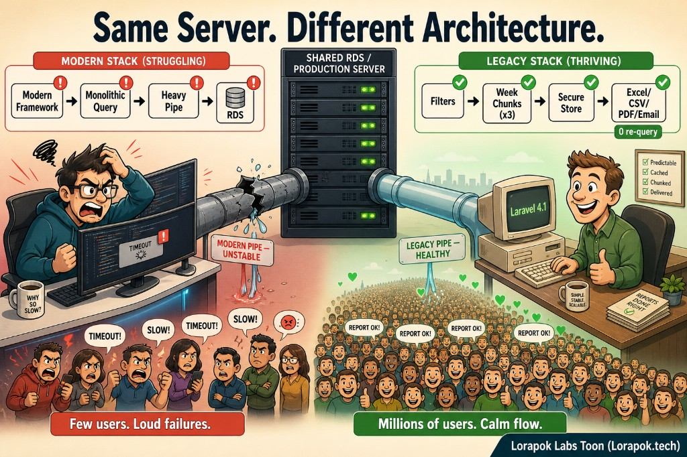
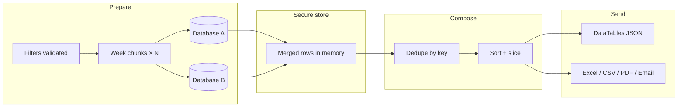
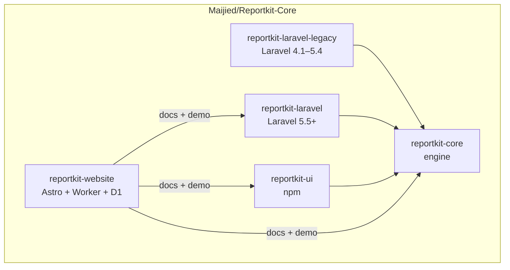
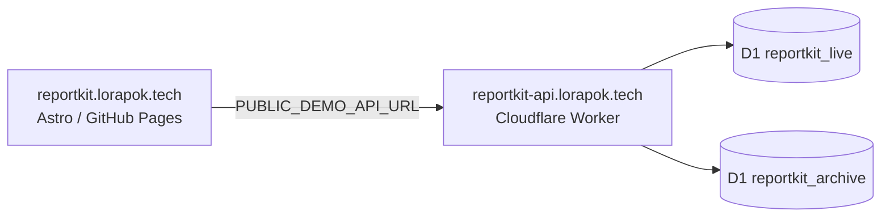

# ReportKit

<p align="center">
  
</p>

<p align="center"><strong>Packages</strong></p>
<p align="center">
  <a href="https://packagist.org/packages/reportkit/core"></a>
  <a href="https://packagist.org/packages/reportkit/laravel"></a>
  <a href="https://packagist.org/packages/reportkit/laravel-legacy"></a>
  <a href="https://www.npmjs.com/package/@lorapok-labs/reportkit-ui"></a>
</p>
<p align="center">
  <a href="https://packagist.org/packages/reportkit/core"></a>
  <a href="https://packagist.org/packages/reportkit/laravel"></a>
  <a href="https://www.npmjs.com/package/@lorapok-labs/reportkit-ui"></a>
</p>

<p align="center"><strong>Deployments</strong></p>
<p align="center">
  <a href="https://github.com/Maijied/Reportkit-Core/deployments/github-pages"></a>
  <a href="https://reportkit.lorapok.tech"></a>
  <a href="https://reportkit-api.lorapok.tech/v1/health"></a>
  <a href="https://github.com/Maijied/Reportkit-Core/actions/workflows/deploy-site.yml"></a>
  <a href="https://github.com/Maijied/Reportkit-Core/actions/workflows/deploy-worker.yml"></a>
</p>

<p align="center"><strong>Release &amp; CI</strong></p>
<p align="center">
  <a href="https://github.com/Maijied/Reportkit-Core/releases"></a>
  <a href="https://github.com/Maijied/Reportkit-Core/actions/workflows/core-ci.yml"></a>
  <a href="https://github.com/Maijied/Reportkit-Core/actions/workflows/orchestrate-release.yml"></a>
</p>

<p align="center"><strong>Languages</strong></p>
<p align="center">
  <a href="https://github.com/Maijied/Reportkit-Core/search?l=php"></a>
  
  <a href="https://github.com/Maijied/Reportkit-Core/search?l=php"></a>
  <a href="https://github.com/Maijied/Reportkit-Core/search?l=astro"></a>
  <a href="https://github.com/Maijied/Reportkit-Core/search?l=typescript"></a>
  <a href="https://github.com/Maijied/Reportkit-Core/search?l=javascript"></a>
  <a href="https://github.com/Maijied/Reportkit-Core/search?l=css"></a>
</p>

<p align="center"><strong>Topics</strong></p>
<p align="center">
  <a href="https://github.com/Maijied/Reportkit-Core"></a>
  <a href="https://github.com/Maijied/Reportkit-Core/topics/php"></a>
  <a href="https://github.com/Maijied/Reportkit-Core/topics/laravel"></a>
  <a href="https://github.com/Maijied/Reportkit-Core/topics/reporting"></a>
  <a href="https://github.com/Maijied/Reportkit-Core/topics/datatables"></a>
  <a href="https://github.com/Maijied/Reportkit-Core/topics/monorepo"></a>
  <a href="https://github.com/Maijied/Reportkit-Core/topics/lorapok"></a>
</p>

<p align="center">
  <a href="https://reportkit.lorapok.tech"></a>
  <a href="https://reportkit.lorapok.tech/docs"></a>
  <a href="https://github.com/Maijied/Reportkit-Core/discussions"></a>
</p>

---
[](https://reporanker.com/repos/Maijied/Reportkit-Core)
---

**Prepare → Secure Store → Compose → Send** — a PHP report stack that stays fast on legacy Laravel and plain PHP, with honest scale labeling on the public demo.

> **Part of the [Lorapok Ecosystem](https://github.com/Maijied/lorapok)** — Building the future of AI-driven developer tools.

> PHP **5.6 → current** · Laravel **4.1 → currently supported**  
> Site: **[reportkit.lorapok.tech](https://reportkit.lorapok.tech)** · API: **[reportkit-api.lorapok.tech](https://reportkit-api.lorapok.tech)**  
> Repo: **[Maijied/Reportkit-Core](https://github.com/Maijied/Reportkit-Core)**  
> License: **[Lorapok-NCL-1.0](./LICENSE)** — free to use and modify; **not free to sell**

---

## Why ReportKit?

Modern stacks often fail under report load — one monolithic query, one heavy pipe, timeouts for everyone. ReportKit takes the opposite path: **chunked prepare, in-memory secure store, zero re-query during export**, then compose and send.

<p align="center">
  
</p>

<p align="center"><em>Left: monolithic query → unstable pipe → timeouts. Right: filters → week chunks → secure store → Excel/CSV/PDF/email with 0 re-query.</em></p>

| Modern pattern (fails) | ReportKit pattern (scales) |
|------------------------|----------------------------|
| One giant SQL per request | Week-chunked reads (concurrency cap) |
| Re-query on every page/export | **Secure store** — merge once, slice many times |
| Opaque “billions of rows” claims | **Provenance badges**: `live` · `synthetic` · `measured` · `cached` |
| Framework version as the story | **Architecture** as the story — old framework, new pipeline |

All public demo data is **fictional** (dummy operators, hub routes, fares). No real customer or production data is used.

---

## Live service

| Resource | URL |
|----------|-----|
| Website | [reportkit.lorapok.tech](https://reportkit.lorapok.tech) |
| Docs | [reportkit.lorapok.tech/docs](https://reportkit.lorapok.tech/docs) |
| Interactive demo | [reportkit.lorapok.tech/demo](https://reportkit.lorapok.tech/demo) |
| Demo API | [reportkit-api.lorapok.tech](https://reportkit-api.lorapok.tech) |
| Discussions | [GitHub Discussions](https://github.com/Maijied/Reportkit-Core/discussions) |

---

## Architecture

### Report pipeline (core thesis)



**Rules**

1. **Prepare** — `DateRangeChunker` splits the window into weekly ranges; each chunk hits the DB with indexed filters.
2. **Secure store** — merged result set lives in memory (PHP) or Worker memory for the request lifecycle.
3. **Compose** — `PseudoPaginator` dedupes, sorts, searches, slices — **no second round-trip to the database**.
4. **Send** — one response shape (DataTables JSON, export, email) with a provenance label on every number.

### Monorepo layout



| Directory | Package | Role |
|-----------|---------|------|
| [reportkit-core/](reportkit-core/) | `reportkit/core` | Chunker, paginator, row sources, exports — **no Laravel** |
| [reportkit-laravel-legacy/](reportkit-laravel-legacy/) | `reportkit/laravel-legacy` | Service provider + facades for Laravel 4.1–5.4 |
| [reportkit-laravel/](reportkit-laravel/) | `reportkit/laravel` | Modern Laravel adapter |
| [reportkit-ui/](reportkit-ui/) | `@lorapok-labs/reportkit-ui` | DataTables + ReportKit browser helpers |
| [reportkit-website/](reportkit-website/) | — | Docs site (GitHub Pages) + Cloudflare Worker demo API |

See [MONOREPO.md](./MONOREPO.md) for CI path filters, secrets, release tags (`core/v*`, `laravel/v*`, `ui/v*`, …), and Packagist mirror runbook.

### Dual-database merge

Production reports often span a **live** database and an **archive**. ReportKit merges them with explicit dedupe and ordering:

```php
use ReportKit\Laravel\Facades\ReportKit;

$source = ReportKit::merged([
    ReportKit::connection('mysql', fn ($q, $f) =>
        $q->from('trips')->whereBetween('booked_at', [$f['start_date'], $f['end_date']])),
    ReportKit::connection('mysql_archive', fn ($q, $f) =>
        $q->from('trips')->whereBetween('booked_at', [$f['start_date'], $f['end_date']])),
])->dedupeBy('trip_id')->orderBy('booked_at', 'desc');
```

**Public demo (Cloudflare D1)** mirrors this model:

| Database | Years | Operator link | Indexes |
|----------|-------|---------------|---------|
| `reportkit_live` | 2018 → present | `trips.operator_id` → `operators.id` | `booked_at`, `operator_id`, composites |
| `reportkit_archive` | 2012 → 2017 | `trips.operator_code` → live `operators.code` | `booked_at`, `operator_code`, composites |

Overlap rows (`trip_id` prefix `X-`) exist in **both** DBs to exercise cross-database dedupe.

### Demo API stack



| Endpoint | Purpose |
|----------|---------|
| `GET /v1/health` | Service + research metadata |
| `GET /v1/data` | DataTables JSON (`mode=live` or `mode=synthetic`) |
| `GET /v1/trace` | Per-stage timings (live / archive / merge) |
| `GET /v1/stats` | Row counts + provenance |
| `GET /v1/weeks` | Weekly ranges for chunking UI |

**Scale honesty**

| Mode | Rows | Meaning |
|------|------|---------|
| `live` | ~1M seeded (500k + 500k) | Real dual-D1 merge on **dummy** indexed data |
| `synthetic` | 50,000,000 virtual | Deterministic generator, 2012 → present, O(1) paging |
| `cached` | Bundled fixtures | Fallback when API or quota unavailable |

Research notes: [reportkit-website/docs/RESEARCH.md](./reportkit-website/docs/RESEARCH.md)

---

## Requirements

| Component | Supported range |
|-----------|-----------------|
| PHP | 5.6 → current |
| Laravel (modern adapter) | 5.5 → 12 / 13 |
| Laravel (legacy adapter) | 4.1 – 5.4 |
| Browser UI | npm `@lorapok-labs/reportkit-ui` |

---

## Install

### Laravel 5.5+ (beta)

```bash
composer require reportkit/core:^0.1@beta reportkit/laravel:^0.1@beta
php artisan reportkit:install --publish-assets
php artisan reportkit:make Sales --route=admin/sales --preset=hybrid
```

### Laravel 4.1–5.4 (legacy)

```bash
composer require reportkit/core:^0.1@beta reportkit/laravel-legacy:^0.1@beta
php artisan reportkit:install --with-config --publish-assets
php artisan reportkit:make Sales --route=admin/sales
```

### Browser UI (npm)

```bash
npm install @lorapok-labs/reportkit-ui@beta
```

Packagist mirror details for Laravel packages: [reportkit-website/docs/PACKAGIST-MONOREPO.md](./reportkit-website/docs/PACKAGIST-MONOREPO.md)

---

## Configuration

### DNS and API domain

| Host | Type | Target | Notes |
|------|------|--------|-------|
| `reportkit.lorapok.tech` | CNAME | `Maijied.github.io` | GitHub Pages (DNS-only until TLS ready) |
| `reportkit-api.lorapok.tech` | Worker route | Cloudflare Worker | Single-level subdomain; proxied when zone is on Cloudflare |

Full step-by-step (D1, secrets, seed, verify): **[reportkit-website/SETUP-DNS.md](./reportkit-website/SETUP-DNS.md)**

**Enable `reportkit-api` (summary)**

1. Ensure **`lorapok.tech`** is on Cloudflare (same account as Worker).
2. **Cloudflare dashboard** → **Workers & Pages → reportkit-demo-api → Domains** → add **`reportkit-api.lorapok.tech`** (proxied). Remove any **`api.reportkit.lorapok.tech`** entry first (nested hostname breaks Free SSL).
3. Deploy Worker via CI (**Actions → Deploy Worker**) — do **not** edit the bundled JS in Cloudflare.
4. In Cloudflare **DNS** for `lorapok.tech`, confirm **Name:** `reportkit-api`, **Proxy:** proxied (usually auto-created by step 2).
5. Verify:
   ```bash
   curl -s https://reportkit-api.lorapok.tech/v1/health
   ```

Until DNS is live, use `https://reportkit-demo-api.mdshuvo40.workers.dev` as a temporary API URL.

---

## Development

| Workflow | Trigger | Purpose |
|----------|---------|---------|
| **Seed D1 (manual)** | Actions dispatch | Batched dummy seed (`research` = 500k + 500k) |
| **Deploy Worker** | Push `worker/**` | Worker + D1 bindings + custom route |
| **Deploy site** | Push site (excl. worker) | GitHub Pages + `PUBLIC_DEMO_API_URL` |
| **Orchestrate beta release** | Dispatch | Core → Laravel → UI → site |

Secrets live on **Reportkit-Core** only — see [MONOREPO.md](./MONOREPO.md).

Local plan and checklist: [PLAN.md](./PLAN.md)

---

## Governance

| Document | Purpose |
|----------|---------|
| [LICENSE](./LICENSE) | Lorapok-NCL-1.0 — free to use and modify; commercial use and sale require permission |
| [CODE_OF_CONDUCT.md](./CODE_OF_CONDUCT.md) | Community standards |
| [CONTRIBUTING.md](./CONTRIBUTING.md) | How to contribute |
| [SECURITY.md](./SECURITY.md) | Vulnerability reporting |

**License summary:** ReportKit is open to use and modify. You may **not** sell the Software, offer it as a paid product or service, or use it commercially without a written license from Lorapok Labs. Contact [mdshuvo40@gmail.com](mailto:mdshuvo40@gmail.com) for commercial terms.

---

## Scope and policy

- **One monorepo**, one secrets panel, path-filtered CI
- Do **not** push package source to Shohoz Azure remotes
- Archive deprecated split repos when convenient
- Never claim 50M rows are physically stored on free-tier D1 — use provenance labels

---

## Community

Questions, ideas, and integration help: **[GitHub Discussions](https://github.com/Maijied/Reportkit-Core/discussions)**.

---

## Author

**Mohammad Maizied Hasan Majumder**  
Creator · [mdshuvo40@gmail.com](mailto:mdshuvo40@gmail.com) · [Lorapok Labs](https://lorapok.tech)

Developed by **Lorapok Labs**. ReportKit is an independent open-source project by the author; it is not a fork of any proprietary host application.

## License

[Lorapok Non-Commercial License 1.0 (Lorapok-NCL-1.0)](./LICENSE)  
Copyright © 2026 Mohammad Maizied Hasan Majumder / Lorapok Labs

Free to use and modify. **Not free to sell** or use commercially without a separate agreement from Lorapok Labs.
