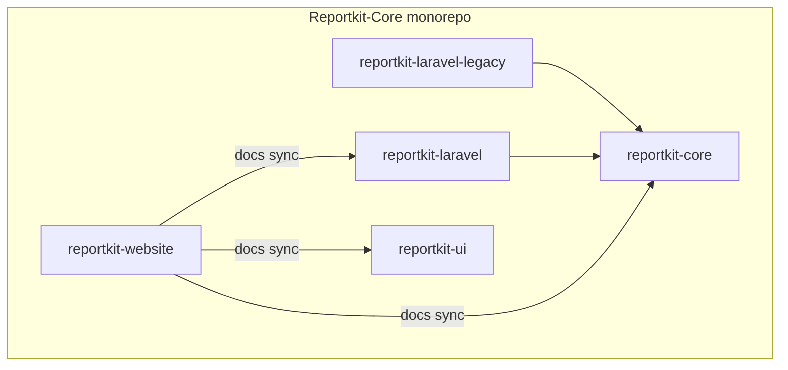

# ReportKit

**Monorepo** for the ReportKit open-source report stack — PHP engine, Laravel adapters, browser UI, docs site, and Cloudflare demo API.

> PHP **5.6 → current** · Laravel **4.1 → currently supported**  
> Site: **https://reportkit.lorapok.tech** · Repo: **[Maijied/Reportkit-Core](https://github.com/Maijied/Reportkit-Core)**

See [MONOREPO.md](./MONOREPO.md) for layout, CI, secrets, and release tags.

## Packages

| Directory | Package | Registry |
|-----------|---------|----------|
| [reportkit-core/](reportkit-core/) | `reportkit/core` | Packagist |
| [reportkit-laravel-legacy/](reportkit-laravel-legacy/) | `reportkit/laravel-legacy` | Packagist |
| [reportkit-laravel/](reportkit-laravel/) | `reportkit/laravel` | Packagist |
| [reportkit-ui/](reportkit-ui/) | `@lorapok-labs/reportkit-ui` | npm |
| [reportkit-website/](reportkit-website/) | Astro site + Worker demo | GitHub Pages |

## Architecture



## Dual-DB (easy path)

```php
use ReportKit\Laravel\Facades\ReportKit;

$source = ReportKit::merged([
    ReportKit::connection('mysql', fn ($q, $f) =>
        $q->from('trips')->whereBetween('booked_at', [$f['start_date'], $f['end_date']])),
    ReportKit::connection('mysql_archive', fn ($q, $f) =>
        $q->from('trips')->whereBetween('booked_at', [$f['start_date'], $f['end_date']])),
])->dedupeBy('trip_id')->orderBy('booked_at', 'desc');
```

## Scope

- One GitHub repo, one secrets panel, path-filtered CI
- Do **not** push to Shohoz Azure remotes
- Archive the old split repos (`Reportkit-Core`, `Reportkit-Laravel`, etc.) when ready

## Author

**Mohammad Maizied Hasan Majumder** · [mdshuvo40@gmail.com](mailto:mdshuvo40@gmail.com) · [Lorapok Labs](https://lorapok.labs)

## License

MIT © Mohammad Maizied Hasan Majumder / Lorapok Labs
