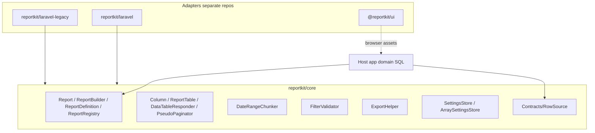

# ReportKit Core

Standalone PHP library for prepare-once / DataTables / export-style reports. Framework-agnostic and Packagist-ready: host apps own **domain SQL**; this package owns reusable report mechanics.

> Package: `reportkit/core` · PHP **5.6 → current** · No Laravel dependency  
> Repository: [Maijied/Reportkit-Core](https://github.com/Maijied/Reportkit-Core)

## Author

**Mohammad Maizied Hasan Majumder**  
[mdshuvo40@gmail.com](mailto:mdshuvo40@gmail.com)

Founder & Principal Engineer at [Lorapok Labs](https://lorapok.labs) · Senior Software Engineer @ [Shohoz Ltd](https://shohoz.com)

## Why ReportKit?

Host apps should own **domain SQL**. ReportKit owns the reusable report mechanics:

- Fluent report definitions (`Report::define`)
- Week-based date chunking (safe prepares over large ranges)
- Filter validation helpers
- DataTables-oriented JSON responders
- Export filename helpers
- Runtime settings store (brand, accents, ceilings) — not a hard-coded `config/reports.php` map

## Architecture



Design rules (also in [docs/ARCHITECTURE.md](docs/ARCHITECTURE.md)):

- **No framework coupling** in this package — Laravel (and others) live in adapter packages.
- **Legacy → current**: Core stays PHP **≥ 5.6**; adapters cover Laravel **4.1 through currently supported majors** (see [docs/COMPATIBILITY.md](docs/COMPATIBILITY.md)).
- **Definitions** (`Report::define`) are code: version-controlled and testable.
- **Settings** (brand name, accent, disclaimer, ceilings) use `SettingsStore`.
- **Domain SQL** always stays in the host application.
- Prepare/export uses **week chunks**. Downloads should compose from prepared store data and must not re-query the full range.

### Feature flags (host)

Declared on each definition; disabled flags should omit routes and UI:

`datatables` · `sync` · `async_prepare` · `kpi` · `email` · `excel` · `csv` · `pdf` · `print` · `howto`

## Features

| Area | Classes |
|------|---------|
| Definitions | `Report`, `ReportBuilder`, `ReportDefinition`, `ReportRegistry` |
| Table / JSON | `Column`, `ReportTable`, `DataTableResponder`, `PseudoPaginator` |
| Dates | `DateRangeChunker` |
| Filters | `FilterValidator` |
| Export names | `ExportHelper` |
| Settings | `SettingsStore`, `ArraySettingsStore` |
| Contract | `RowSource` |

## Requirements

- PHP **≥ 5.6.0**
- No Laravel (or other framework) dependency

## Install

```bash
composer require reportkit/core
```

Until Packagist publish, use VCS:

```json
{
  "repositories": [
    {
      "type": "vcs",
      "url": "https://github.com/Maijied/Reportkit-Core.git"
    }
  ],
  "require": {
    "reportkit/core": "dev-main"
  }
}
```

Local path (workspace sibling of a host app):

```json
{
  "type": "path",
  "url": "../reportkit/reportkit-core",
  "options": { "symlink": true }
}
```

## Quick start

```php
use ReportKit\Core\Report\Report;
use ReportKit\Core\Table\Column;
use ReportKit\Core\Table\ReportTable;

Report::define('demo', function ($report) {
    $report
        ->title('Demo Report')
        ->flags(['datatables', 'excel', 'csv', 'pdf'])
        ->table(
            ReportTable::make('main')
                ->title('Results')
                ->serverSide()
                ->columns([
                    Column::make('id', 'ID'),
                    Column::make('name', 'Name'),
                ])
        );
});
```

Full surface: [docs/API.md](docs/API.md) · Design notes: [docs/ARCHITECTURE.md](docs/ARCHITECTURE.md) · Matrix: [docs/COMPATIBILITY.md](docs/COMPATIBILITY.md)

## Ecosystem

ReportKit spans **legacy → currently supported** PHP and Laravel (see [docs/COMPATIBILITY.md](docs/COMPATIBILITY.md)).

| Package | Role | PHP | Laravel |
|---------|------|-----|---------|
| `reportkit/core` | This repository — engine only | **5.6 → current** | — |
| `reportkit/laravel-legacy` | Classic adapter | 5.6 – 7.4 | **4.1 – 5.4** |
| `reportkit/laravel` | Modern adapter | 7.0 – **current** | **5.5 → current** (through **12 / 13**) |
| `@reportkit/ui` | Browser CSS/JS | — | Any host |

“Current” means majors still on Laravel/PHP security support (today Laravel **12.x** and **13.x**, PHP **8.3–8.5**). Historical LTS lines (**Laravel 5.5**, **6**) are covered by `reportkit/laravel`.

## Development

```bash
composer install
vendor/bin/phpunit
```

- Autoload: `ReportKit\Core\` → `src/`
- Tests: `ReportKit\Core\Tests\` → `tests/`
- Tag: `v0.1.0`

## License

MIT © Mohammad Maizied Hasan Majumder / Lorapok Labs
