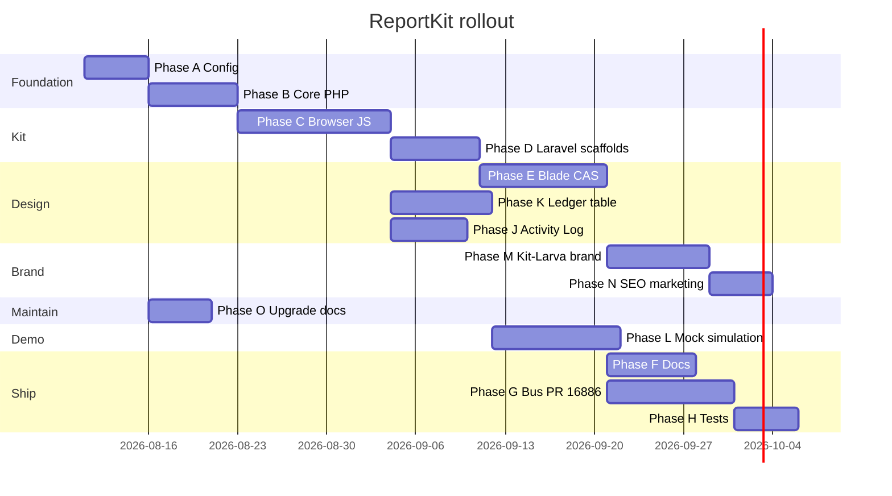
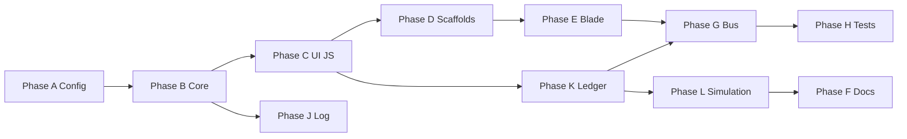

# Implementation order

**Depends on:** [OVERVIEW.md](./OVERVIEW.md)  
**Last updated:** 2026-08-10

---

## Gantt

---

## Dependency graph

---

## Sprint 1 (this week)

| Task | Phase | Deliverable |
|------|-------|-------------|
| Expand `config/reportkit.php` | A1 | All keys including `table.*`, `logging.*` |
| `prepare-loader` + `action-bar` partials | E2 | CAS loader + action bar |
| `ledger-panel` partial stub | K2 | Table shell + KPI row |
| ActivityLog ring buffer | J2 | PHP + JS stub |
| `BLADE-COMPONENTS.md` outline | F3 | Partial catalog |
| Animated flow spec | L1 | `simulation/ANIMATED-FLOW.md` ✓ |

---

## Sprint 2

| Task | Phase |
|------|-------|
| Port `createPrepareRunner` | C1 |
| `ReportKit.table.fromPreparedStore` | K4 |
| Mock ledger generator | L2 |
| `HandlesReportWeeks` trait | B5 |

---

## Sprint 3

| Task | Phase |
|------|-------|
| Full Blade partial library | E2 |
| `/showcase` animated demo page | L3 |
| Bus config extraction | G4 |
| Capacity test port patterns | H4 |

---

## First integration milestone

**Target:** `reportkit:make Ledger --preset=hybrid-browse` renders:

1. Filter panel → prepare loader → secure store commit
2. KPI row updated from JSON aggregates
3. Ledger DataTable pages prepared rows (PseudoPaginator)
4. Excel/CSV export from same JSON (no SQL)
5. Activity log panel shows categorized timeline

**Exit:** Demo at `/demo?mode=hybrid-browse` with synthetic 50M virtual backing.
