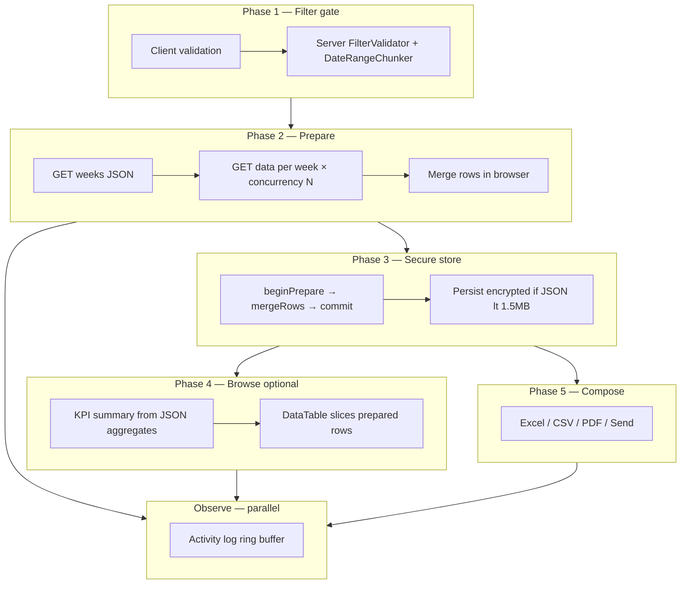
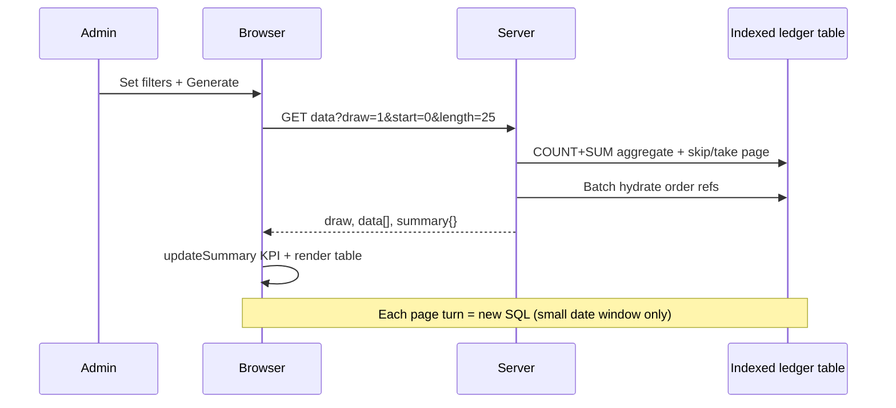

# ReportKit — Overview

**Goal:** Packages deliver the full report stack — PHP engine, browser kit, Blade design system, ledger table UX, activity log, and public mock simulation — **config-driven**, with **zero re-query** after prepare.

---

## Two report archetypes

ReportKit supports two proven bus patterns. Host apps pick one via `reportkit:make` preset.

| Archetype | Bus reference | Data flow | Table after fetch |
|-----------|---------------|-----------|-------------------|
| **Hybrid export** | PR [#16886](../references/bus-pr-16886.md) | Week-chunk prepare → secure store → compose | KPI grid only (optional browse in Phase K) |
| **Sync ledger browse** | PR [#16817](../references/bus-pr-16817.md) | Filter → SQL page → KPI + DataTable | ServerSide SQL pagination |
| **Hybrid browse** (package) | Combines both | Week-chunk prepare → store → **JSON browse** | PseudoPaginator on prepared rows — **no domain SQL** |

---

## Five-phase runtime (hybrid export + browse)

**Rule:** Phases 4 and 5 read **only** from prepared JSON in memory or session — never hit domain SQL again.

---

## Sync ledger flow (billing-style)

Package delivers **Blade + JS + responder**; host owns SQL.

---

## Proven ceilings (config defaults)

| Setting | Value | Config key |
|---------|-------|------------|
| Max date span (export) | 6 months | `date.max_months` |
| Max date span (ledger sync) | 31 days | `date.ledger_max_days` |
| Week concurrency | 3 | `prepare.concurrency` |
| Session persist max | ~1.5MB JSON | `store.session_persist_max_bytes` |
| Excel soft max | 25,000 rows | `export.excel_soft_max_rows` |
| PDF single pass | 105,303 rows | `export.pdf_single_pass_max_rows` |
| PDF proven max | 287,484 rows | documented benchmark |
| CSV chunk | 400 rows | `export.csv_chunk_rows` |
| Mail attach max | 25MB | `mail.hard_attach_max_bytes` |
| Ledger page cap | 10,000 | `table.page_limit_max` |
| PHP memory (long export) | 2048M | `export.memory_limit` |

---

## Package layout

| Directory | Package | Role |
|-----------|---------|------|
| `reportkit-core/` | `reportkit/core` | PHP engine, PseudoPaginator, ActivityLog |
| `reportkit-laravel-legacy/` | `reportkit/laravel-legacy` | L4.1 adapter + Blade partials |
| `reportkit-laravel/` | `reportkit/laravel` | Modern Laravel adapter |
| `reportkit-ui/` | `@lorapok-labs/reportkit-ui` | JS + CAS CSS |
| `reportkit-website/` | — | Docs, demo, animated simulator |

---

## Success criteria

| Check | Target |
|-------|--------|
| PR #16886 parity | 29/29 `ExportReportCornerCaseTest` |
| PR #16817 UX parity | Ledger table + KPI from package partials |
| JSON browse | Sort/search/page with **zero** post-prepare SQL |
| Activity log | &lt;5ms overhead per 1k events |
| Mock simulation | Animated flow covers all corner cases |
| Kit-Larva brand | Logo + GIFs synced to all package paths |
| SEO | Sitemap, JSON-LD, OG mascot images live |
| Upgrade docs | 0.1 → 0.2 path documented for hosts |
| Synthetic scale | 50M virtual + 1M measured seed documented |
| Config-only ceilings | No magic numbers in host blade/JS |
| Policy | Zero package commits to Azure |

---

## Author

Mohammad Maizied Hasan Majumder · Lorapok Labs · Shohoz Ltd
