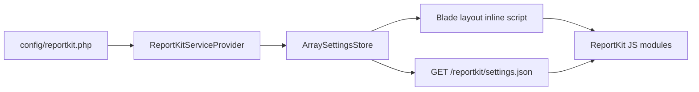

# Critical path — config to browser

---

## Steps

1. **Host publishes** `config/reportkit.php` (ceilings, brand, logging, table, design)
2. **ServiceProvider** maps keys → `ArraySettingsStore` at boot
3. **Optional route** exposes public-safe subset as JSON (no secrets)
4. **Layout** inlines `window.__REPORTKIT_SETTINGS__` to avoid extra round-trip
5. **JS modules** read settings once at init — prepare, store, export, table, log

---

## Public-safe JSON keys

`brand`, `date`, `prepare`, `store`, `export`, `mail`, `notifications`, `logging.enabled`, `logging.panel`, `table`, `design`

**Never expose:** DB credentials, API keys, internal routes.

---

## Per-report overrides

`Report::define('ledger')->settings(['date' => ['ledger_max_days' => 14]])` merges at runtime into store snapshot for that report only.
