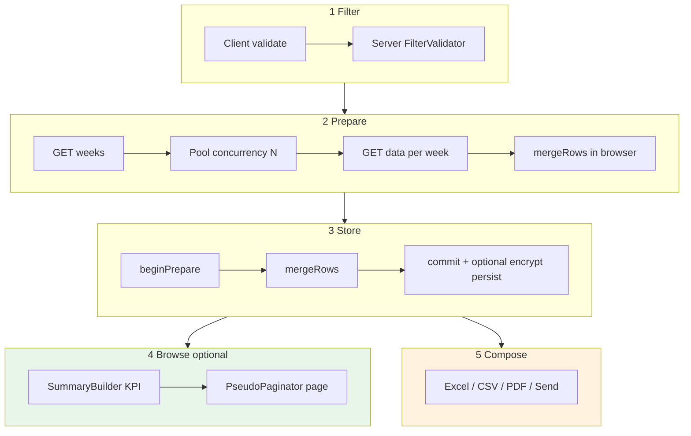

# Critical path — prepare → export flow

Full hybrid export + optional browse pipeline.

**SQL allowed:** phases 1–2 only (weeks + data chunks).  
**SQL forbidden:** phases 4–5 after successful prepare.

---

## Prepare progress (staging observed)

After **Fetch & Prepare**, the loader shows week batches fetched in parallel (concurrency **3**):

| Message pattern | Meaning |
|-----------------|--------|
| `Fetching weeks 1-3 of 5 in parallel (0 of 5 done)…` | First batch of up to 3 weeks |
| `(1 of 5 done)` … `(5 of 5 done)` | Completed week count |
| Percent bar | `doneWeeks / totalWeeks` |

Example: **2026-07-10 → 2026-08-10**, company **6**, Offline → **5 weeks**, ~**50s** total.

On success: **Prepared Results** KPI grid appears; Excel / CSV / PDF / Send Report enable. Prepared rows live in **browser memory only** (secure store).

---

## Compose phase (no re-query)

All exports read the **same prepared store**. No `GET export-data` during compose.

| Format | UX (staging) | Row basis | Notes |
|--------|--------------|-----------|-------|
| **CSV** | Instant browser download; **no** compose overlay | Ticket rows (61,441 in 1-mo test) | Silent `Blob` save; buttons stay enabled |
| **Excel** | Same pattern as CSV (not re-tested this run) | Ticket rows | Soft max may fallback to CSV |
| **PDF** | **Preparing download** overlay; button shows `PDF N%`; **Ping me / Mute / Cancel** | **PNR rows** (39,645) — not ticket count | Example: **376 pages**, ETA ~1m; all export buttons **disabled** until done |
| **Send** | Modal stepper: Prepare ZIP → Enter email → Send → Success | CSV inside ZIP (0.39 MB) | Mail uses `Export_{UserType}_{companyId}_{slug}_{dates}.csv.zip` |

Send ZIP filename pattern (observed):

`Export_Offline_6_Hanif_Enterprise_Chittagong_2026-07-10_to_2026-08-10.csv.zip`

---

## Page reload — full reset

**Reload discards all prepared state.** Observed after F5 / navigate to same URL:

| State | After reload |
|-------|----------------|
| Company / dates | Cleared (`Select a company`, empty date fields) |
| Filter summary chips | `Company — User Type — Start Date — End Date —` |
| Prepared Results / KPI | **Hidden** — section not rendered |
| Export + Send buttons | **Disabled** |
| Fetch & Prepare | **Disabled** until filters re-selected |
| User Type default | Still **Offline** (page default only) |

There is **no** sessionStorage restore of prepared rows on reload. User must **Fetch & Prepare** again before any export or send.

ReportKit parity: `ReportKit.store` must clear on `beforeunload` / page init; optional encrypted persist (CORNER-CASE 11) is explicit opt-in, not default reload behavior.

---

## Sync ledger alternate path

Filter → SQL aggregate + page → KPI + table (no prepare). See [bus-pr-16817.md](../references/bus-pr-16817.md).

---

## Error exits

| Point | Response |
|-------|----------|
| Filter fail | `{ error: string }` — stop |
| Week fetch fail | toast + activity log `network.error` |
| **Session invalid / HTML response** | AJAX gets login HTML (302) → `Unexpected token '<'` — dismiss loader, show `{ error }` toast (not a prepare bug) |
| **Shared account / stale session** | Same as above — stuck **0%** or immediate JSON parse error |
| Cancel prepare | discard partial store |
| Cancel PDF compose | abort in-browser PDF job; re-enable export buttons |
| Store too large | memory-only, log `store.warn` |
| Export over ceiling | fallback CSV or zip, log `export.warn` |
