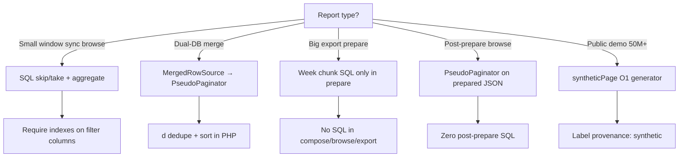

# Query optimization — decision tree

When to use SQL pagination vs in-memory PseudoPaginator vs virtual generators.

---

## Decision tree



---

## Pattern 1 — Sync ledger (PR #16817)

**When:** Date window ≤31 days, live SQL, no prepare phase.

| Step | Query |
|------|-------|
| Aggregate | One query: COUNT + SUM(credit) + SUM(debit) |
| Page | `skip(start)->take(length)` on indexed ledger |
| Hydrate | Batch load related refs for page IDs |
| Search | Pre-resolve IDs or LIKE on indexed columns |

**Host owns SQL.** Package provides `DataTableResponder` + Blade.

---

## Pattern 2 — Dual-DB merge

**When:** Live + archive DBs, same schema.

| Step | Action |
|------|--------|
| Fetch | Query each DB with same filters |
| Merge | `MergedRowSource::fetch()` |
| Dedupe | `PseudoPaginator::dedupeByKey('trip_id')` |
| Sort | `sortBy('booked_at', 'desc')` |
| Page | `slice($start, $length)` |

---

## Pattern 3 — Hybrid export (PR #16886)

**When:** Up to 6 months, large row counts.

| Phase | SQL |
|-------|-----|
| Prepare weeks | 1 × weeks query |
| Prepare data | 1 × data query per week (concurrency 3) |
| Store | none |
| Browse | **none** (PseudoPaginator on JSON) |
| Export | **none** |

---

## Pattern 4 — Virtual synthetic

**When:** Demo/marketing scale (50M+).

```typescript
syntheticRow(index) // O(1) deterministic
syntheticPage(start, length) // max 100 rows per request
```

No table storage required. Honest `synthetic` provenance badge.

---

## Anti-patterns

| Anti-pattern | Why bad |
|--------------|---------|
| Re-query on Excel after prepare | Doubles RDS load |
| Load 287k rows into DataTables DOM | Browser crash |
| Log full row arrays | Memory + privacy |
| Sync file write in prepare loop | Blocks hot path |
| 50M rows in D1 free tier | Misleading claims |

---

## Index checklist (host SQL)

For ledger tables:

- `(client_code, transaction_date DESC)`
- `(transaction_type)`
- `(reference_id)` where PNR joins used

For trip tables:

- `(booked_at)`
- `(operator_code, booked_at)`
