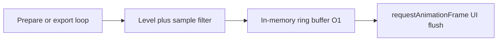
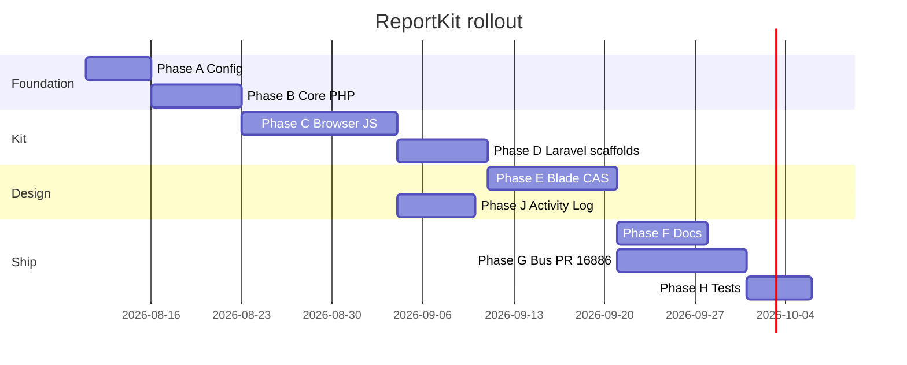

# Phase J — Activity Log

**Doc:** [plan index](../README.md)

---

**Outcome:** Developers and power users see a **professional, categorized timeline** of filters, AJAX responses, exports, and errors — **without measurable slowdown** on prepare/export hot paths.

## J1. Categories & levels

| Category | Examples |
|----------|----------|
| `filter` | validation pass/fail, date range computed |
| `prepare` | weeks fetched, week N started/done, cancel |
| `store` | begin, merge count, commit, persist skipped (too large) |
| `export.excel` | started, fallback to CSV, completed + duration |
| `export.csv` | chunked progress milestones |
| `export.pdf` | pages, merge volumes, zip fallback |
| `send` | zip built, email validated, POST result |
| `network` | HTTP status, timeout, abort |
| `validation` | server `{ error }` messages |
| `system` | settings loaded, feature flag skipped module |

Levels: `debug` · `info` · `success` · `warn` · `error`

## J2. Performance architecture (non-negotiable)



| Rule | Implementation |
|------|----------------|
| **No I/O on hot path** | No file, DB, or network writes during prepare/export loops |
| **O(1) push** | Fixed-size ring buffer; drop oldest when full |
| **Cheap when disabled** | Single `if (!enabled) return` — no string build |
| **No row payloads** | Log counts, durations, HTTP status — never full row arrays |
| **Sample under load** | `sample_rate` + skip duplicate week progress events |
| **Async UI** | Panel updates batched via `requestAnimationFrame` (max 4/sec) |
| **Server optional tail** | AJAX may append `_reportkit_log[]` only when `logging.include_in_ajax` true |
| **Redaction** | Strip `_token`, emails partial-masked in panel |

## J3. APIs

**PHP** (`reportkit/core`):

```php
ActivityLog::info('prepare', 'Week 3/9 fetched', ['rows' => 842, 'ms' => 120]);
ActivityLog::flushToArray(); // for optional AJAX tail
```

**JS** (`reportkit-ui`):

```js
ReportKit.log.info('prepare', 'Week 3/9 fetched', { rows: 842, ms: 120 });
ReportKit.log.subscribe(fn); // panel only
ReportKit.log.exportJson();  // download for support tickets
```

## J4. Blade panel (`reportkit::ui.activity-log`)

- Collapsible drawer (default collapsed; `local` env auto-expand)
- Filter chips by category + level
- Timestamp + duration columns
- Copy / export JSON / clear
- Styled with CAS tokens — matches send stepper quality
- Hidden entirely when `flags.activity_log` false or `logging.enabled` false

## J5. Config

```php
'logging' => [
    'enabled' => env('REPORTKIT_LOG', false),
    'panel' => 'local',       // local | always | never
    'level' => 'info',
    'buffer_max' => 200,
    'sample_rate' => 1.0,
    'include_in_ajax' => false,
    'redact' => ['password', 'token', '_token'],
],
```

**Default:** `enabled => false` in production. Bus enables in staging/dev for PR validation.

## J6. Tests

- [ ] Buffer never exceeds `buffer_max`
- [ ] Disabled logging: prepare benchmark ± noise vs baseline
- [ ] Enabled logging: overhead **&lt; 5ms** per 1,000 events (unit)
- [ ] Redaction removes sensitive keys
- [ ] Panel renders last 200 entries without locking main thread (manual QA)

---

## Implementation order



**First sprint:** A1 config schema · E2 `prepare-loader` + `action-bar` partials · J2 ring buffer stub · F3 `BLADE-COMPONENTS.md` outline.

---

## Success criteria

| Check | Target |
|-------|--------|
| PR feature parity | Every row in parity checklist ✓ |
| Export Report on packages | 29/29 corner-case tests pass |
| Blade design system | Zero inline export CSS in bus consumer |
| Config-only ceilings | No magic numbers in host blade/JS |
| Activity log | Categorized timeline; **&lt;5ms** overhead per 1k events |
| New report scaffold | `reportkit:make` → hybrid export in &lt;30 min |
| Docs | Host dev integrates from docs alone |
| Packagist | `0.2.x-beta` on core + laravel-legacy |
| Policy | Zero package commits to Azure |

---

## Monorepo layout

| Directory | Package | Role |
|-----------|---------|------|
| `reportkit-core/` | `reportkit/core` | PHP engine, mail, **ActivityLog** |
| `reportkit-laravel-legacy/` | `reportkit/laravel-legacy` | L4.1 adapter + **Blade partials** |
| `reportkit-laravel/` | `reportkit/laravel` | Modern adapter |
| `reportkit-ui/` | `@lorapok-labs/reportkit-ui` | JS + **CAS CSS** |
| `reportkit-website/` | — | Docs, demo, showcase |

See [MONOREPO.md](./MONOREPO.md) · [SETUP-DNS.md](./reportkit-website/SETUP-DNS.md)

---

## Do not

- Push package source to Shohoz Azure remotes
- Put domain SQL inside ReportKit packages
- Re-query RDS after prepare succeeds
- Log full row payloads or PII in Activity Log
- Write logs to disk/DB synchronously during prepare/export
- Hard-code Shohoz brand in package core (use settings)
- Ship 4,000-line consumer blades — use partials

---

## Author

**Mohammad Maizied Hasan Majumder** · Lorapok Labs · Shohoz Ltd  
Plan owner: [bus PR #16886](https://dev.azure.com/Shohoz/ticket/_git/bus/pullrequest/16886)
