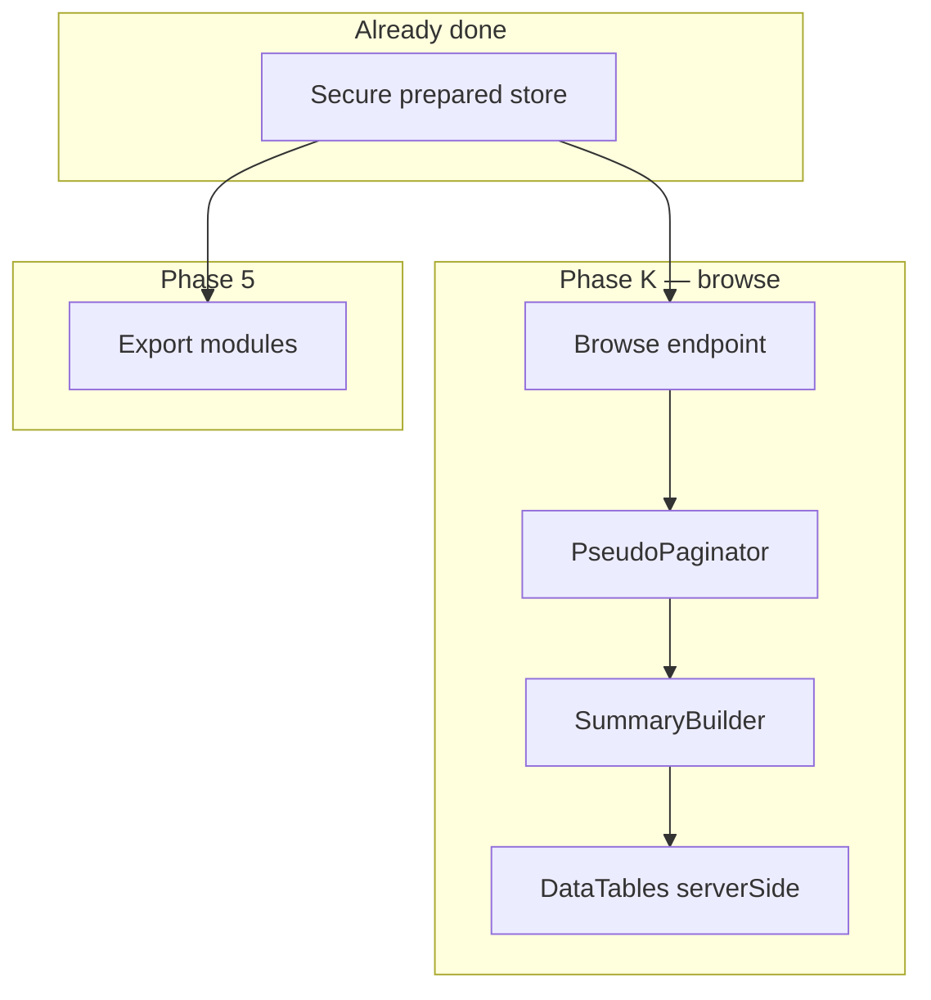

# Phase K — Ledger table + JSON browse

**Depends on:** Phase C (browser kit), Phase B (`PseudoPaginator`, `DataTableResponder`)  
**Blocks:** Phase L (simulation), Phase G (bus prepaid integration)  
**References:** [bus-pr-16817.md](../references/bus-pr-16817.md)

---

## Outcome

After prepare completes, admins browse a **billing-quality ledger table** and KPI row from **prepared JSON only** — sort, search, and page without domain SQL.

Sync preset `ledger-sync` delivers the same UX with host SQL (small date windows).

---

## Requirements

| ID | Requirement |
|----|-------------|
| K-R1 | Table renders ≥18 configurable columns with CAS styling |
| K-R2 | KPI summary updates on every DataTables draw from `summary` JSON |
| K-R3 | Active filter chips appear after successful fetch |
| K-R4 | Export/print disabled until first successful data load |
| K-R5 | Post-prepare browse: **SQL query count = 0** for paging/search/sort |
| K-R6 | `page_limit = -1` capped at `table.page_limit_max` (10,000) |
| K-R7 | Txn type pills via configurable type→class map |
| K-R8 | Table loading overlay during AJAX (non-blocking UI thread) |
| K-R9 | Horizontal scroll for wide ledgers; optional sticky header |
| K-R10 | Compose (Excel/CSV/PDF) reads same prepared JSON as table |

---

## Architecture



---

## Tasks

| Task | Deliverable |
|------|-------------|
| K1 | `SummaryBuilder` — aggregates credit/debit/balance/health from row set | done |
| K2 | `HandlesReportBrowse` trait — slice/search/sort prepared rows | done |
| K3 | `reportkit::ui.ledger-panel` — table markup + overlay | done |
| K4 | `reportkit::ui.filter-totals` — credit/debit strip | done |
| K5 | `reportkit::ui.txn-pill` — type badge partial | done |
| K6 | `ReportKit.table.fromPreparedStore(opts)` — wires DataTables to browse endpoint | done |
| K7 | `dataSrc` hook → `ReportKit.kpi.apply` + enable exports | done |
| K8 | Preset `hybrid-browse` + `ledger-sync` in `reportkit:make` | done |
| K9 | CSS: `.rk-ledger-table`, `.rk-txn-pill--*`, `.rk-table-loader` | done |
| K10 | Optional `design.ledger_enhanced` — sticky header, float scroll |

---

## Browse endpoint contract

```json
{
  "draw": 1,
  "recordsTotal": 8420,
  "recordsFiltered": 120,
  "data": [ { "transaction_date": "…", "credit_amount": "…" } ],
  "summary": {
    "current_balance": "12,450.00",
    "total_credit": "8,200.00",
    "total_debit": "3,100.00",
    "warning_level": "ok"
  }
}
```

Prepared-row session key: `reportkit_prepared_{reportId}` — never log row contents.

---

## Performance

| Operation | Target |
|-----------|--------|
| PseudoPaginator slice | O(n) search + O(1) slice — acceptable for ≤500k prepared rows |
| SummaryBuilder | Single pass O(n); cache until store version changes |
| DataTables draw | &lt;100ms for 25 rows at 100k prepared (measured, synthetic) |
| Enhanced virtual scroll | Required above 500k prepared rows (Phase K10) |

---

## Exit criteria

- [x] Demo `/demo?mode=hybrid-browse` shows ledger after prepare
- [ ] KPI matches billing layout (wallet-style metrics)
- [ ] Zero post-prepare SQL verified in integration test
- [ ] Package partials replace billing inline CSS
