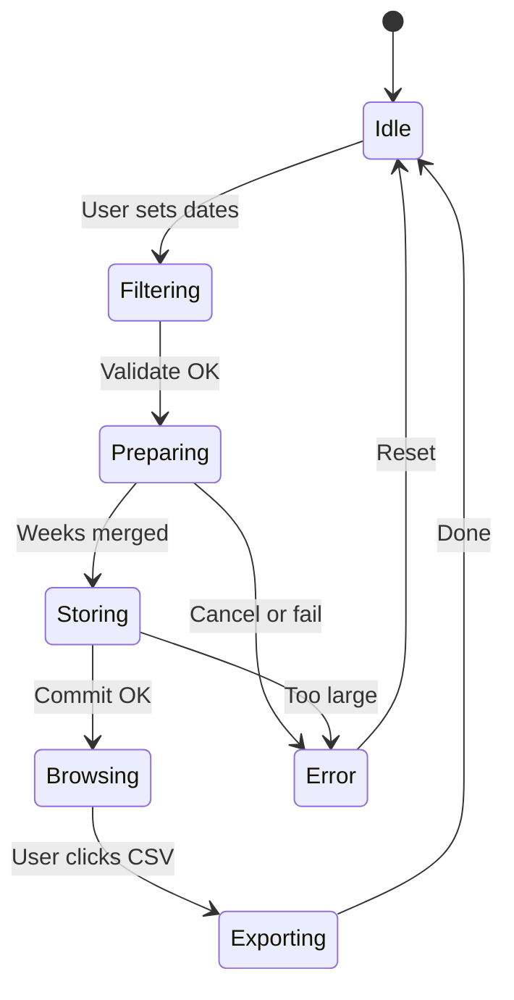

# Phase L — Mock simulation + animated flow

**Depends on:** Phase K (ledger table), Phase C (prepare JS), Phase J (activity log)  
**Blocks:** Phase F (public docs)  
**Privacy:** All data **fictional** — no real bus/customer information

---

## Outcome

Public demo at `reportkit.lorapok.tech/simulation` runs an **animated end-to-end flow** through filter → prepare → store → browse → compose, replaying **all corner cases** against a **multi-million-row synthetic database**.

---

## Requirements

| ID | Requirement |
|----|-------------|
| L-R1 | Animated timeline shows each phase with live counters |
| L-R2 | Mock DB supports 50M virtual rows + 1M measured D1 seed |
| L-R3 | Ledger schema with fictional clients, txn types, running balances |
| L-R4 | Corner-case playlist runs unattended (CI-safe headless mode) |
| L-R5 | Activity log panel syncs with simulation events |
| L-R6 | Provenance badges: `live` · `measured` · `synthetic` · `cached` |
| L-R7 | Pause / step / speed control for showcase |
| L-R8 | No network calls to real bus or production DB |
| L-R9 | Completes full playlist in &lt;3 min at 8× speed |
| L-R10 | Mobile-friendly read-only view (animation degrades gracefully) |

---

## Mock database design

See [MOCK-DATABASE.md](../simulation/MOCK-DATABASE.md).

**Layers:**

| Layer | Scale | Purpose |
|-------|-------|---------|
| D1 live | 500k rows | Measured paging benchmarks |
| D1 archive | 500k rows | Dual-DB merge demo |
| Virtual synthetic | 50M address space | O(1) generator paging |
| Ledger synthetic | 10M txns | Billing browse stress |
| Session prepared | up to 500k rows | Hybrid-browse ceiling test |

**Fictional entities:** operators (Northline Transit, …), routes (HUB-A-HUB-B), clients (CLIENT-001…), txn types (recharge, ticket_sell, ticket_cancel, admin_debit, balance_reset).

---

## Animated flow spec

See [ANIMATED-FLOW.md](../simulation/ANIMATED-FLOW.md).

Each transition animates: progress bar, week counter, row count, KPI cards, log entries.

---

## Tasks

| Task | Deliverable |
|------|-------------|
| L1 | `simulation/ANIMATED-FLOW.md` ✓ |
| L2 | `worker/src/ledger-synthetic.ts` — deterministic txn generator |
| L3 | Extend D1 seed scripts for ledger tables |
| L4 | Astro page `/simulation` — canvas + controls | done |
| L5 | `ReportKit.simulation.run(playlist)` — JS driver | done |
| L6 | Corner-case playlist JSON — see CORNER-CASES.md | done |
| L7 | Wire activity log to simulation events | done |
| L8 | Benchmarks page links + provenance labels |
| L9 | Headless Playwright smoke for CI |
| L10 | `/showcase` card linking to simulation | done |

---

## Corner cases (playlist)

See [CORNER-CASES.md](../simulation/CORNER-CASES.md) — 29+ scenarios mirroring export tests plus ledger-specific cases.

---

## Exit criteria

- [ ] `/simulation` loads and runs default playlist
- [ ] All CORNER-CASES marked pass in demo
- [ ] 50M virtual + 1M measured documented with honest labels
- [ ] Zero fictional data resembles real bus records
