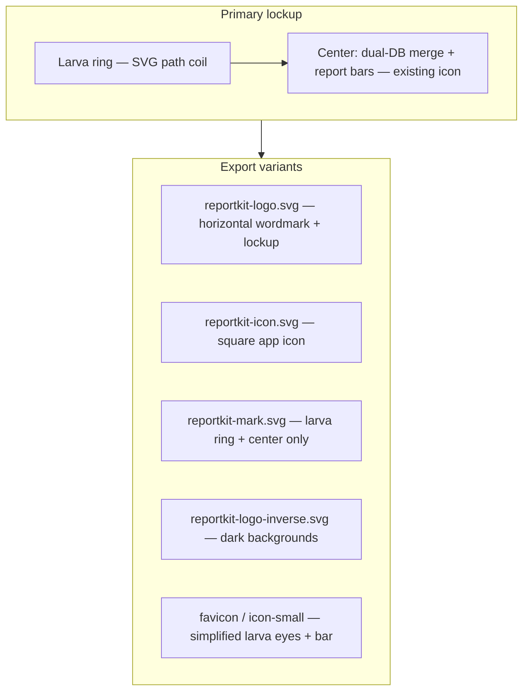

# Phase M — Brand mascot & logo system

**Depends on:** Phase E (CAS tokens)  
**Blocks:** Phase N (SEO/marketing assets), Phase L (simulation branding)  
**Codename:** **Kit-Larva** (Cybernetic Soldier Fly Larva)

---

## Outcome

Replace the ReportKit mark everywhere with a **unified logo system**: current data-flow icon at center, **Kit-Larva** wrapped around it like an ouroboros — the friendly background optimizer that makes data processing feel **live**.

---

## Mascot design brief

| Attribute | Spec |
|-----------|------|
| Form | Plump, segmented larva body; cute, approachable proportions |
| Limbs | Small robotic legs (6–8), subtle joint hinges |
| Eyes | Large, expressive, **glowing neon-green** pupils |
| Armor | Sleek **dark charcoal / metallic** plating (`#1a1f24`, `#2d3439`) |
| Accent panels | Bright **neon-green** glow inserts (`#0b7a4b`, `#22a06b`, glow `#8ef0c4`) |
| Pose | Coils around the existing ReportKit merge icon (snake/ouroboros ring) |
| Motion cue | Segments suggest peristalsis — “consuming bottlenecks” |
| Tone | Friendly helper, never aggressive; silent background worker |
| Symbolism | Optimizes prepare/store/browse pipelines without blocking the user |

**Do not:** military weapons, realistic insect gore, or scary biomech horror.

---

## Logo composition



### Layer rules

1. **Center glyph** — preserve current merge narrative (live DB + archive DB → report bars).
2. **Larva ring** — 1.5–2 wraps; head near top-right with eyes visible at 32px+.
3. **Clear space** — minimum padding = height of one larva segment.
4. **Min sizes** — favicon 16px: center bars + two eye dots; 32px+: segment hints.

---

## Animated & marketing assets

| Asset | Format | Use |
|-------|--------|-----|
| `kit-larva-idle.gif` | GIF / WebP | Docs hero, README, loader Easter egg |
| `kit-larva-prepare.gif` | GIF / WebP | Prepare overlay; segments pulse with progress |
| `kit-larva-consume.mp4` | MP4 (short) | Social / product page |
| `og-image-mascot.png` | 1200×630 | Open Graph / Twitter card |
| `og-image-mascot-square.png` | 1200×1200 | LinkedIn / GitHub social preview |
| `hero-marketing.png` | 2400×1350 | Homepage hero |
| `product-sheet-*.png` | PNG set | Features grid (prepare, store, browse, export) |
| `simulation-banner.png` | 1600×900 | `/simulation` page |
| `loader-larva.svg` | SVG + SMIL/CSS | Inline async loader (lightweight) |

**Animation principles:** loop ≤3s; neon pulse on green panels; larva “advances” one segment per prepare week in sync demos.

---

## File rollout map (replace everywhere)

| Location | Files |
|----------|-------|
| `brand/` (repo root) | All SVG + PNG masters |
| `reportkit-core/assets/` | icon, mark |
| `reportkit-laravel/assets/` | icon, mark |
| `reportkit-laravel-legacy/assets/` | icon, mark |
| `reportkit-ui/` | optional CSS background sprite |
| `reportkit-website/public/` | favicon, logos, og images, gifs |
| `reportkit-website/public/brand/` | full kit + `/brand/png/` |
| `reportkit-website/brand/` | source copies |
| `reportkit-website/assets/` | README raw URLs |
| Package README.md headers | GitHub raw PNG links |
| Packagist README.packagist.md | same |
| `reportkit-website/src/pages/brand.astro` | gallery + download ZIP |
| PDF export watermark | optional larva mark mono |

---

## Tasks

| Task | Deliverable | Status |
|------|-------------|--------|
| M1 | Design spec + CYBER-LARVA-MASCOT.md | ✅ |
| M2 | Master SVG `reportkit-icon.svg` (Kit-Larva v2) | ✅ |
| M3 | Variants: mark, logo, inverse, small, og | ✅ |
| M4 | `export-brand-png.sh` + PNG exports | ✅ |
| M5 | Animated GIFs idle + prepare | ✅ |
| M6 | `sync-brand-assets.sh` | ✅ |
| M7 | `/brand` page gallery updated | ✅ |
| M8 | Nav favicon + OG image | ✅ |
| M9 | README PNG assets | ✅ |
| M10 | Packagist README headers | ✅ |
| M11 | Async loader larva GIF hook | ✅ |

---

## Config hook (optional)

```php
'brand' => [
    'mascot_enabled' => true,
    'logo_path' => 'vendor/reportkit/laravel-legacy/assets/reportkit-logo.svg',
    'loader_animation' => 'kit-larva-prepare.gif',
],
```

Host apps may disable mascot in strict enterprise themes via `mascot_enabled => false` (falls back to v1 icon).

---

## Exit criteria

- [ ] All paths in rollout map show new larva lockup
- [ ] `/brand` documents mascot story + downloads
- [ ] ≥2 animated GIFs shipped in `public/brand/animated/`
- [ ] Favicon legible at 16×16
- [ ] No stale v1-only logo in monorepo grep
