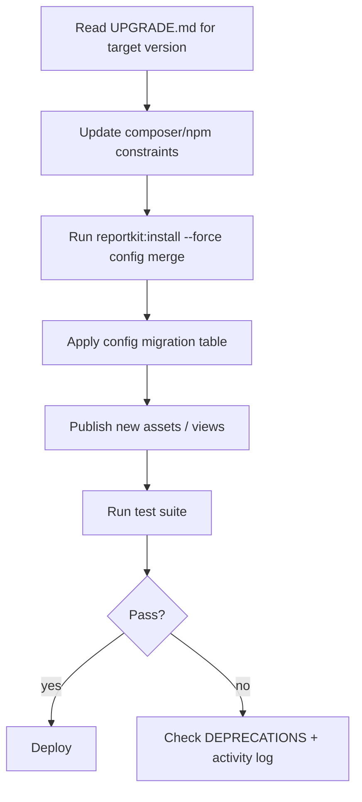

# Phase O — Developer upgrade & migration docs

**Depends on:** Phase A (config schema), Phase F (doc sync)  
**Audience:** Package maintainers, host app developers (bus + Laravel)

---

## Outcome

Any developer can **upgrade ReportKit safely** across minor/patch releases using versioned guides, config migration tables, and automated checks — without reading git history.

---

## Requirements

| ID | Requirement |
|----|-------------|
| O-R1 | Semver policy documented and enforced in tags |
| O-R2 | `UPGRADE.md` in each package + root pointer |
| O-R3 | Per-version migration notes (`CHANGELOG` + upgrade section) |
| O-R4 | Config key migration table when keys rename |
| O-R5 | Breaking change checklist before major bump |
| O-R6 | Host runbook: path repo → Packagist → verify tests |
| O-R7 | Deprecation window: min 1 minor before removal |
| O-R8 | `reportkit:doctor` artisan command (future) stubs documented |
| O-R9 | Bus-specific migration path cross-linked |
| O-R10 | Upgrade docs synced to `/docs/0.1/maintenance/` |

---

## Versioning policy

| Bump | When |
|------|------|
| **MAJOR** | Breaking PHP API, removed config keys, Blade section renames |
| **MINOR** | New features, new partials, new config keys (defaults safe) |
| **PATCH** | Bug fixes, doc fixes, CSS token tweaks |

Monorepo tags: `core/v*`, `laravel-legacy/v*`, `ui/v*` (see `MONOREPO.md`).

---

## Documentation tree

```
reportkit-core/docs/
  UPGRADE.md              ← master upgrade guide
  CHANGELOG.md            ← Keep a Changelog format
  DEPRECATIONS.md         ← timeline of sunsetting APIs

reportkit-laravel-legacy/docs/
  UPGRADE.md              ← adapter-specific (L4.1)
  HOST-INTEGRATION.md     ← links here

reportkit-laravel/docs/
  UPGRADE.md              ← modern Laravel

reportkit-ui/docs/
  UPGRADE.md              ← JS API breaks

plan/docs/
  UPGRADE-PROCESS.md      ← maintainer runbook (this repo)

reportkit-website/src/content/docs/0.1/maintenance/
  upgrade-overview.md
  upgrade-0.1-to-0.2.md
  config-migrations.md
  deprecations.md
```

---

## Upgrade process (host developer)



### Composer example

```bash
composer require reportkit/core:0.2.* reportkit/laravel-legacy:0.2.*
php artisan reportkit:install
php artisan vendor:publish --tag=reportkit-views --force
npm update @lorapok-labs/reportkit-ui   # if using npm bundle
```

---

## Config migration table (template)

Document in `config-migrations.md` for each release:

| Old key (≤0.1) | New key (0.2) | Default | Action |
|----------------|---------------|---------|--------|
| `date.max_range_months` | `date.max_months` | 6 | rename |
| — | `logging.enabled` | false | new |
| — | `table.page_limit_max` | 10000 | new |
| — | `brand.mascot_enabled` | true | new |

Provide PHP merge snippet for host `config/reportkit.php`.

---

## Breaking change checklist (maintainers)

Before tagging MAJOR:

- [ ] Entry in `DEPRECATIONS.md` with removal version
- [ ] `UPGRADE.md` section with before/after code
- [ ] Stub aliases for one minor if feasible (`ShohozCommonReport` pattern)
- [ ] Update `plan/PARITY-CHECKLIST.md` if bus affected
- [ ] Sync website docs via `npm run sync:docs`
- [ ] Packagist mirror workflow green

---

## Future tooling (documented, implement later)

| Tool | Purpose |
|------|---------|
| `reportkit:doctor` | Validates config, asset versions, flag mismatches |
| `reportkit:diff-config` | Prints keys missing vs package default |
| CI `upgrade-smoke.yml` | Installs N-1 → N on sample app |

---

## Tasks

| Task | Deliverable | Status |
|------|-------------|--------|
| O1 | [UPGRADE-PROCESS.md](../docs/UPGRADE-PROCESS.md) maintainer runbook | ✅ |
| O2 | Root + package `UPGRADE.md` stubs | ✅ |
| O3 | `DEPRECATIONS.md` in core | ✅ |
| O4 | Astro docs `/maintenance/*` pages | ✅ |
| O5 | `sync-docs.mjs` includes upgrade docs | ✅ |
| O6 | Config migration table for 0.1 → 0.2 | ✅ |
| O7 | Bus migration cross-link in `plan/references/bus-pr-16886.md` | ✅ |
| O8 | CONTRIBUTING.md section: “How to write upgrade notes” | ✅ |

---

## Exit criteria

- [ ] Developer can upgrade 0.1 → 0.2 using docs only
- [ ] Every package has `UPGRADE.md` linked from README
- [ ] Website `/docs/0.1/maintenance/upgrade-overview` live
- [ ] Config migrations table complete for 0.2 beta
