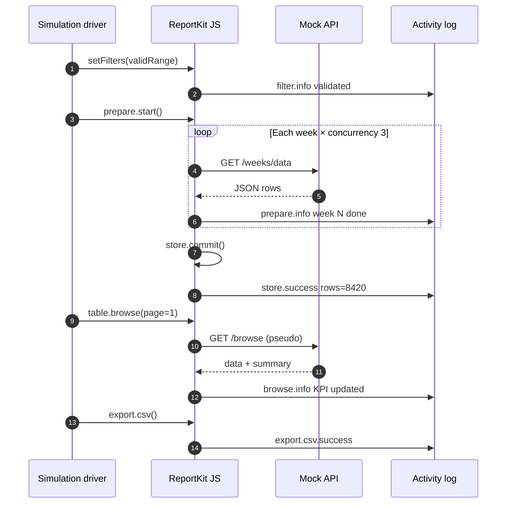

# Animated flow — public simulation spec

**Page:** `reportkit.lorapok.tech/simulation`  
**Tech:** Astro + `@lorapok-labs/reportkit-ui` + CSS animations (no heavy video)

---

## UI layout

```
┌─────────────────────────────────────────────────────────┐
│  ReportKit Simulation          [▶ Play] [⏸] [⏭] 8× ▼  │
├─────────────────────────────────────────────────────────┤
│  PHASE RAIL (animated)                                    │
│  [Filter] → [Prepare] → [Store] → [Browse] → [Export]   │
├──────────────────────┬──────────────────────────────────┤
│  LIVE MOCK PANEL     │  ACTIVITY LOG (categorized)       │
│  • filters           │  09:01:02 prepare Week 3/9 ✓      │
│  • progress ring     │  09:01:04 store commit 8420 rows  │
│  • KPI cards         │  09:01:05 browse page 1/337       │
│  • mini ledger table │  09:01:06 export csv started       │
├──────────────────────┴──────────────────────────────────┤
│  CORNER CASE: [dropdown]  Status: ● Running case 7/29    │
└─────────────────────────────────────────────────────────┘
```

---

## Phase rail animation

Each phase node transitions: `idle` → `active` (pulse) → `done` (check) → `error` (red flash).

| Phase | Visual | Duration (1×) |
|-------|--------|-----------------|
| Filter | Form fields type in; validation green tick | 2s |
| Prepare | Week chips fill; progress 0→100%; concurrency 3 lanes | 8–15s |
| Store | Lock icon; byte meter vs 1.5MB cap | 2s |
| Browse | KPI count-up; table rows fade in | 3s |
| Export | File icon + ETA bar | 4–20s |

Speed multiplier: 1×, 2×, 4×, 8×.

---

## Full flow sequence (default playlist)



---

## Mock API endpoints (Worker / demo)

| Endpoint | Returns |
|----------|---------|
| `GET /v1/sim/weeks` | Synthetic week list |
| `GET /v1/sim/data?week=` | Chunk of fictional trip rows |
| `GET /v1/sim/browse` | PseudoPaginator page + summary |
| `GET /v1/sim/ledger` | Ledger synthetic page |
| `POST /v1/sim/reset` | Clear session state |

All responses include `_provenance: "synthetic"`.

---

## Animation implementation

| Element | Technique |
|---------|-----------|
| Phase rail | CSS `@keyframes` width + color |
| Progress ring | SVG `stroke-dashoffset` |
| KPI count-up | `requestAnimationFrame` lerp |
| Table rows | Staggered `opacity` + `translateY` |
| Log entries | Ring buffer + batched DOM (Phase J rules) |
| Error flash | `#rk-alert` shake + red border |

**Performance:** animation loop must not block prepare/export mock (separate timers).

---

## Integration with Activity Log

Every simulation step calls:

```js
ReportKit.log.info(category, message, { ms, rows, case_id });
```

Log panel filters by active corner case.

---

## Headless CI mode

`?headless=1&case=excel-fallback` — no animation, assert JSON contracts only.  
Used in `.github/workflows/demo-simulation.yml` (Phase L9).

---

## Exit criteria

- [ ] Default playlist runs start-to-finish at 8× in &lt;3 min
- [ ] All phases visually distinct on phase rail
- [ ] Activity log stays &lt;5ms overhead per 1k events during animation
- [ ] Works without jQuery on modern demo (optional jQuery path for L4.1 docs)
