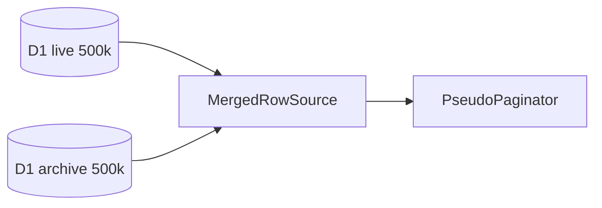

# Mock database — fictional multi-million schema

**Privacy:** All names, codes, and amounts are **synthetic**. Do not copy bus schema literals or real client identifiers.

---

## Design goals

1. Stress-test prepare, browse, and export at **millions of rows**
2. Mirror **complexity patterns** from large ticket systems (dual DB, ledger, aggregates)
3. Stay on **free-tier D1** for measured seeds; use **virtual generators** for 50M+
4. Support both **trip reports** and **ledger browse** demos

---

## Schema (fictional)

### `rk_trips_live` / `rk_trips_archive`

| Column | Type | Notes |
|--------|------|-------|
| `trip_id` | TEXT PK | `SYN-{hex}` or `LIVE-{n}` |
| `booked_at` | DATE | 2012–2026 span |
| `operator_code` | TEXT | FK to operators |
| `route_code` | TEXT | HUB-* codes |
| `channel` | TEXT | online / offline |
| `seats` | INT | 1–4 |
| `fare_cents` | INT | synthetic |
| `status` | TEXT | confirmed / cancelled |
| `_source` | TEXT | live / archive |

**Indexes:** `(booked_at)`, `(operator_code, booked_at)`

### `rk_operators`

| Column | Type |
|--------|------|
| `code` | TEXT PK |
| `name` | TEXT |

20 fictional operators (see `generate.ts` OPERATORS list).

### `rk_ledger_entries` (new — Phase L)

| Column | Type | Notes |
|--------|------|-------|
| `entry_id` | TEXT PK | `LED-{hex}` |
| `client_code` | TEXT | CLIENT-001…CLIENT-050 |
| `transaction_date` | DATETIME | |
| `transaction_type` | TEXT | recharge, ticket_sell, … |
| `reference_id` | TEXT | optional trip link |
| `credit_amount` | DECIMAL | |
| `debit_amount` | DECIMAL | |
| `balance_after` | DECIMAL | running balance |
| `comments` | TEXT | synthetic |

**Indexes:** `(client_code, transaction_date)`, `(transaction_type)`, `(reference_id)`

### `rk_clients` (fictional prepaid wallets)

| Column | Type |
|--------|------|
| `client_code` | TEXT PK |
| `display_name` | TEXT |
| `opening_balance` | DECIMAL |
| `warning_threshold_pct` | INT |

---

## Scale tiers

| Tier | Rows | Storage | Mode | Provenance |
|------|------|---------|------|------------|
| `dev` | 2,000 | D1 | live SQL | measured |
| `research` | 1M (500k+500k) | dual D1 | merge + prepare | measured |
| `research-full` | 5M | D1 batch | stress | measured |
| `synthetic` | 50M trips | none (generator) | virtual paging | synthetic |
| `ledger-synthetic` | 10M entries | generator | browse stress | synthetic |

---

## Generator rules (`ledger-synthetic.ts`)

```typescript
// Deterministic — same seed → same ledger
function syntheticLedgerEntry(index: number): LedgerEntry {
  // xorshift from index
  // assign client_code, type, amounts
  // balance_after = prev + credit - debit per client stream
}
```

**Transaction mix (approx):**

| Type | Share |
|------|-------|
| ticket_sell | 55% |
| ticket_cancel | 12% |
| recharge | 20% |
| admin_debit | 8% |
| balance_reset | 5% |

---

## Dual-D1 merge pattern



Dedupe key: `trip_id`. Sort: `booked_at desc`.

---

## Query optimization (mock API)

| Pattern | When |
|---------|------|
| SQL `LIMIT/OFFSET` | sync browse, ≤31-day window, measured D1 |
| Generator `syntheticPage(start, len)` | 50M virtual — O(1) per row |
| In-memory `PseudoPaginator` | post-prepare hybrid-browse |
| Single-pass `SummaryBuilder` | KPI from filtered prepared rows |
| Batch aggregate SQL | ledger COUNT+SUM in one query (sync preset) |

---

## Seed commands (documented in RESEARCH.md)

```bash
# Measured 1M dual-D1
SEED_SCALE=research node reportkit-website/worker/seed/generate-research-seed.mjs

# Ledger extension (Phase L)
SEED_SCALE=ledger-synthetic node reportkit-website/worker/seed/generate-ledger-seed.mjs
```

---

## Do not

- Import bus CSV dumps or production snapshots
- Use real operator names (Shohoz, Green Line, etc.)
- Store real PNR or mobile numbers in seeds
