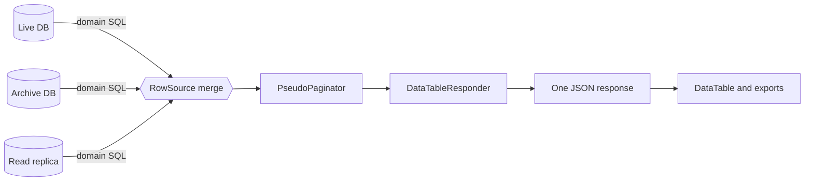
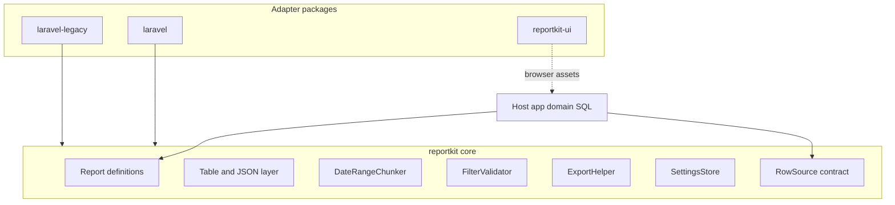
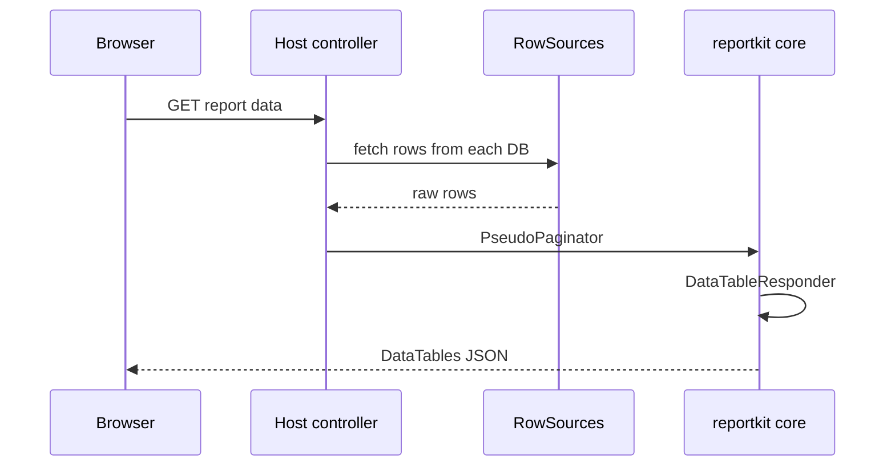
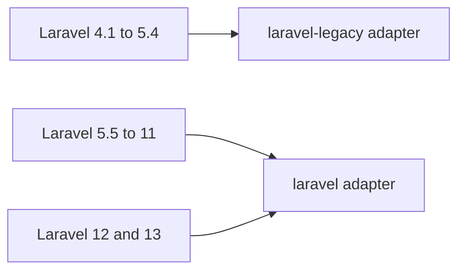

<p align="center">
  
</p>

<h1 align="center">ReportKit&nbsp;Core</h1>

<p align="center"><strong>Merge many databases. Emit one JSON. Report on anything.</strong></p>

<p align="center">
  
  <a href="https://packagist.org/packages/reportkit/core"></a>
  <a href="https://packagist.org/packages/reportkit/core"></a>
  
  <a href="https://github.com/Maijied/Reportkit-Core/actions/workflows/ci.yml"></a>
  <a href="LICENSE"></a>
</p>

<p align="center">
  <a href="https://reportkit.lorapok.tech"></a>
</p>

<p align="center">
  <a href="https://reportkit.lorapok.tech">Website &amp; Docs</a> ·
  <a href="https://reportkit.lorapok.tech/showcase">Live Demo</a> ·
  <a href="docs/API.md">API</a> ·
  <a href="docs/ARCHITECTURE.md">Architecture</a> ·
  <a href="docs/COMPATIBILITY.md">Compatibility</a>
</p>

> **Part of the Lorapok Labs ecosystem** — engineering the reporting layer that big Laravel apps keep rewriting by hand.

---

## What is ReportKit?

**ReportKit Core** is a framework‑agnostic PHP engine for *prepare‑once → paginate → export* reports. Your application keeps its **domain SQL**; ReportKit owns the reusable mechanics that every reporting screen needs: date chunking, filter validation, in‑memory paging/dedupe, DataTables‑shaped JSON, and export naming.

The signature use case: **pull rows from several databases (live + archive + read‑replicas), merge them, and serve a single clean JSON response** to a DataTable or an export — fast, and without re‑querying the whole range on every download.



---

## Why ReportKit?

- **Multi‑DB merge, one payload.** Combine rows from any number of connections through the `RowSource` contract, then dedupe/sort/page them in memory.
- **Prepare once, export many.** Long date ranges are split into **week chunks**; downloads compose from prepared data instead of re‑running the full query.
- **DataTables‑native.** `DataTableResponder` speaks server‑side DataTables out of the box (draw / recordsTotal / recordsFiltered / data).
- **Definitions are code.** `Report::define()` is version‑controlled and unit‑testable — no magic config map.
- **Legacy → current.** The engine runs on PHP **5.6 → 8.5**; adapters cover Laravel **4.1 → 13**.
- **Zero framework coupling.** Not a single Laravel import in this package.

---

## Architecture



**Design rules** (full notes in [docs/ARCHITECTURE.md](docs/ARCHITECTURE.md)):

- **No framework coupling** — Laravel lives in adapter packages.
- **Definitions** (`Report::define`) are code: version‑controlled and testable.
- **Settings** (brand, accent, disclaimer, ceilings) use `SettingsStore` — not a hard‑coded `config/reports.php` map.
- **Domain SQL** always stays in the host application.
- Prepare/export uses **week chunks**; downloads compose from prepared store data and must not re‑query the full range.

### Request lifecycle



### Feature flags (host‑declared)

Declared on each definition; disabled flags omit routes and UI:

`datatables` · `sync` · `async_prepare` · `kpi` · `email` · `excel` · `csv` · `pdf` · `print` · `howto`

---

## Features

| Area | Classes |
|------|---------|
| Definitions | `Report`, `ReportBuilder`, `ReportDefinition`, `ReportRegistry` |
| Table / JSON | `Column`, `ReportTable`, `DataTableResponder`, `PseudoPaginator` |
| Dates | `DateRangeChunker` |
| Filters | `FilterValidator` |
| Export names | `ExportHelper` |
| Settings | `SettingsStore`, `ArraySettingsStore` |
| Contract | `RowSource` |

---

## Requirements

- PHP **≥ 5.6.0**
- No Laravel (or other framework) dependency

## Install

```bash
composer require reportkit/core
```

Track the beta channel while ReportKit stabilises:

```bash
composer require "reportkit/core:^0.1@beta"
```

<details>
<summary>Install straight from Git (VCS) or a local path</summary>

```json
{
  "repositories": [
    { "type": "vcs", "url": "https://github.com/Maijied/Reportkit-Core.git" }
  ],
  "require": { "reportkit/core": "dev-main" }
}
```

Local path (workspace sibling of a host app):

```json
{ "type": "path", "url": "../reportkit/reportkit-core", "options": { "symlink": true } }
```

</details>

## Quick start

```php
use ReportKit\Core\Report\Report;
use ReportKit\Core\Table\Column;
use ReportKit\Core\Table\ReportTable;

Report::define('demo', function ($report) {
    $report
        ->title('Demo Report')
        ->flags(['datatables', 'excel', 'csv', 'pdf'])
        ->table(
            ReportTable::make('main')
                ->title('Results')
                ->serverSide()
                ->columns([
                    Column::make('id', 'ID'),
                    Column::make('name', 'Name'),
                ])
        );
});
```

Merge two databases behind one report (host owns the SQL):

```php
use ReportKit\Core\Table\PseudoPaginator;
use ReportKit\Core\Table\DataTableResponder;

$rows = array_merge(
    $liveDb->select($domainSql, $bindings),      // connection A
    $archiveDb->select($domainSql, $bindings)    // connection B
);

$page = (new PseudoPaginator($rows))
    ->searchBy($request->search, ['name', 'email'])
    ->sortBy($request->orderColumn, $request->orderDir)
    ->page($request->start, $request->length);

return DataTableResponder::make($page)->toArray();
```

Full surface: [docs/API.md](docs/API.md) · Design notes: [docs/ARCHITECTURE.md](docs/ARCHITECTURE.md)

---

## Ecosystem

ReportKit spans **legacy → currently supported** PHP and Laravel.

| Package | Role | PHP | Laravel |
|---------|------|-----|---------|
| [`reportkit/core`](https://github.com/Maijied/Reportkit-Core) | This repository — engine only | **5.6 → 8.5** | — |
| [`reportkit/laravel-legacy`](https://github.com/Maijied/Reportkit-Laravel-Legacy) | Classic adapter | 5.6 – 7.4 | **4.1 – 5.4** |
| [`reportkit/laravel`](https://github.com/Maijied/Reportkit-Laravel) | Modern adapter | 7.0 – current | **5.5 → 12 / 13** |
| [`@lorapok-labs/reportkit-ui`](https://github.com/Maijied/Reportkit-UI) | Browser CSS/JS | — | Any host |



---

## Development

```bash
composer install
vendor/bin/phpunit
```

- Autoload: `ReportKit\Core\` → `src/`
- Tests: `ReportKit\Core\Tests\` → `tests/`
- Releases follow SemVer with `beta` / `rc` / `stable` channels — see [VERSIONING](https://reportkit.lorapok.tech/docs/versioning).

---

## Author

**Mohammad Maizied Hasan Majumder** (Maijied) · Senior Software Engineer @ **Shohoz Ltd** · Founder @ **Lorapok Labs**  
Dhaka, Bangladesh · [mdshuvo40@gmail.com](mailto:mdshuvo40@gmail.com) · [GitHub @Maijied](https://github.com/Maijied)

Full profile: [AUTHORS.md](../AUTHORS.md)

## License

MIT © Mohammad Maizied Hasan Majumder / Lorapok Labs
