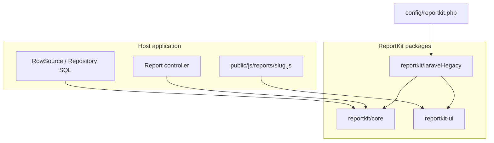

# ReportKit architecture

ReportKit Core is a **standalone** library. Adapters and host apps are separate projects.

ReportKit implements **LLDP** (Lorapok Labs Design Pattern): **Prepare → Secure Store → Compose → Deliver**. See [LLDP.md](LLDP.md) for the full contract.

## Two-layer browser architecture

| Layer | Location | Responsibility |
|-------|----------|----------------|
| **Common kit** | `@lorapok-labs/reportkit-ui` (`reportkit.js`, `lldp-core.js`) | Week runner, secure store, export compose, mail upload, notify |
| **Page controller** | Host `public/js/reports/{slug}.js` from `reportkit:make` stubs | Filter wiring, KPI field map, domain columns, `ReportKitPageConfig` |

Host Blade views `@include` package partials only — they do not embed thousands of lines of inline JS/CSS.



## Core layout

```
reportkit/core
  Date\DateRangeChunker
  Filter\FilterValidator
  Export\ExportHelper
  Mail\MailService
  Http\{AjaxResponse, HandlesReportWeeks, HandlesReportSend, HandlesReportBrowse}
  Report\{Report, ReportBuilder, ReportDefinition, ReportRegistry}
  Table\{Column, ReportTable, DataTableResponder, PseudoPaginator, PreparedRowBrowse}
  Settings\{SettingsStore, BrowserSettingsBuilder, ReportBrowserSettings}
  Contracts\RowSource
```

## Design rules

- **No framework coupling** in core — Laravel adapters live in separate packages.
- **Legacy → current**: Core stays PHP **≥ 5.6**; adapters cover Laravel **4.1 through current majors** ([COMPATIBILITY.md](COMPATIBILITY.md)).
- **Definitions** (`Report::define`) are code: version-controlled and testable.
- **Settings** flow config → `BrowserSettingsBuilder` → `window.__REPORTKIT_SETTINGS__`.
- **Domain SQL** always stays in the host application.
- After prepare completes, exports read the **prepared store only** — zero post-prepare SQL.

## Feature flags

Declared on each definition; disabled flags omit routes, partials, and JS bundles:

`datatables` · `sync` · `async_prepare` · `browse_prepared` · `kpi` · `ledger` · `email` · `excel` · `csv` · `pdf` · `print` · `howto` · `activity_log`

Browser bundle gates are exposed as `bundles` in the settings payload (`lldp`, `datatables`, `export`, `mail`, …).

## Scale tiers (T0–T5)

| Tier | Pattern |
|------|---------|
| T0 | Sync server-side browse |
| T1 | Week-chunk async prepare (default) |
| T2 | Stream / volume compose |
| T3 | Dual-DB merge in host `RowSource` |
| T4 | Warehouse / read-replica strangler |
| T5 | Synthetic demo fixtures |

## Author

**Mohammad Maizied Hasan Majumder** (Maijied) — Founder, [Lorapok Labs](https://lorapok.tech) · Senior Software Engineer @ Shohoz Ltd · Dhaka, Bangladesh
