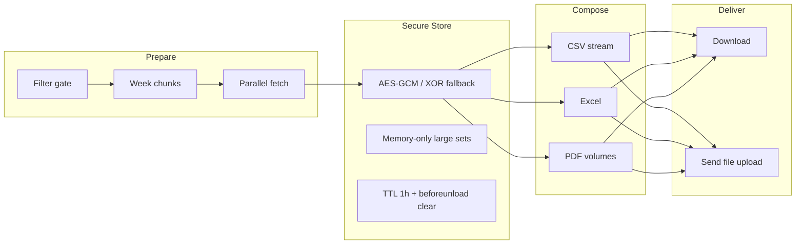

# LLDP — Lorapok Labs Design Pattern

**Prepare → Secure Store → Compose → Deliver (P-S-C-D)**

ReportKit implements LLDP as the reference architecture for reliable reporting against complex, high-volume databases. Host applications own domain SQL and row shaping; ReportKit owns the pipeline, browser store, export composition, and delivery contracts.

## Six invariants

1. **Zero post-prepare SQL** — After the prepare phase completes, Excel/CSV/PDF/Send must not trigger additional database queries. All export formats read from the prepared row set only.
2. **Partition before parallelize** — Date ranges split into week chunks (or day slices for short ranges). Each chunk is fetched independently with bounded concurrency.
3. **Backpressure** — Concurrency limits, chunk processing, and progress UI prevent browser and server overload during prepare and compose.
4. **Format literacy** — Each export format has documented row ceilings, fallbacks (e.g. Excel → CSV), and streaming thresholds.
5. **Filter-only invalidation** — Changing filters invalidates prepared data; pagination and sort on prepared rows do not.
6. **Complex joins in host only** — Multi-table logic lives in the host `RowSource` / repository. Packages never embed proprietary schema.

## P-S-C-D pipeline



## Scale tiers (T0–T5)

| Tier | Pattern | When |
|------|---------|------|
| **T0** | Sync browse | Small datasets; server-side DataTables only |
| **T1** | Week-chunk prepare | Default async export; concurrency 3 |
| **T2** | Stream / volume compose | CSV/PDF above soft thresholds |
| **T3** | Dual-DB merge | Host merges sources in `RowSource` before prepare |
| **T4** | Warehouse strangler | Read replica or OLAP for heavy aggregates |
| **T5** | Synthetic demo | Worker/fixture mode for docs and benchmarks |

## Browser secure store

Prepared JSON is encrypted in the browser when Web Crypto is available (AES-GCM 256). Non-secure contexts use XOR-B64 obfuscation. Keys stay in RAM only. Payloads under ~1.5 MB may persist to `sessionStorage`; larger sets remain memory-only. Data clears on `beforeunload`, new prepare, filter change, and after a 1-hour TTL.

## Server send contract

LLDP Deliver validates **file before email**:

1. Multipart field `file` (not `report_file`)
2. Upload size vs `upload_max_filesize` / `post_max_size`
3. Email format and optional DNS MX check
4. Host mailer dispatches using validated upload

## PHP surface

| Component | Role |
|-----------|------|
| `DateRangeChunker` | Week list for prepare |
| `FilterValidator` | Filter gate |
| `ExportHelper` | Ceilings, filenames, long-running hints |
| `MailService` | Upload validation, ZIP attachment plan |
| `HandlesReportSend` | `reportSendFromUpload()` — file-before-email |

## JavaScript surface

Load order: jQuery → `lldp-core.js` → `reportkit.js`.

| API | Role |
|-----|------|
| `ReportKit.createPrepareRunner()` | Week-chunk fetch with cancel/progress |
| `ReportKit.createSecurePreparedStore()` | Encrypted prepared row store |
| `ReportKit.formatReportError()` | Normalize AJAX/Laravel errors |
| `ReportKit.normalizeWeekRows()` | Accept bare array or `{ rows }` |
| `ReportKit.initSecureStore()` | Wire secure store to `ReportKit.store` |

## Configuration keys

```php
'prepare' => ['concurrency' => 3, 'ajax_timeout_ms' => 120000],
'store' => ['ttl_ms' => 3600000, 'encryption_enabled' => true],
'export' => ['stream_csv_row_threshold' => 50000],
'features' => ['pattern' => 'lldp'],
```

## Further reading

- [ARCHITECTURE.md](./ARCHITECTURE.md) — package layout
- [CONFIGURATION.md](./CONFIGURATION.md) — full config reference
- [reportkit.lorapok.tech/features/lldp](https://reportkit.lorapok.tech/features/lldp) — product overview
