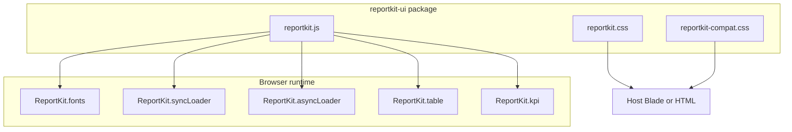

<p align="center">
  
</p>

<h1 align="center">@lorapok-labs/reportkit-ui</h1>

<p align="center"><strong>The browser layer for ReportKit — design tokens, page chrome, and DataTables helpers.</strong></p>

<p align="center">
  
  <a href="https://www.npmjs.com/package/@lorapok-labs/reportkit-ui"></a>
  <a href="https://www.npmjs.com/package/@lorapok-labs/reportkit-ui"></a>
  
  <a href="https://github.com/Maijied/Reportkit-Core/actions/workflows/ui-ci.yml"></a>
  <a href="LICENSE"></a>
</p>

<p align="center">
  <a href="https://reportkit.lorapok.tech"></a>
</p>

<p align="center">
  <a href="https://reportkit.lorapok.tech">Website &amp; Docs</a> ·
  <a href="https://reportkit.lorapok.tech/showcase">Live Demo</a> ·
  <a href="docs/CSS.md">CSS</a> ·
  <a href="docs/JS.md">JS</a> ·
  <a href="docs/UPGRADE.md">Upgrade</a>
</p>

> **Part of the Lorapok Labs ecosystem.** Framework-free CSS + JS that pairs with the [`reportkit/core`](https://github.com/Maijied/Reportkit-Core) engine and its Laravel adapters.

---

## What is @lorapok-labs/reportkit-ui?

`@lorapok-labs/reportkit-ui` gives ReportKit reports a consistent, professional look and the client behaviour they need: CAS design tokens, page chrome, sync/async loaders, KPI cards, and first-class server-side DataTables helpers — including **export the current view without re-querying**.

## Architecture



Layout order (CAS): **page-head → filter → summary → KPI → panels → loaders → send → howto**.

---

## JS surface

| API | Purpose |
|-----|---------|
| `ReportKit.fonts.ensure()` | Inject Manrope/Sora |
| `ReportKit.syncLoader.*` | Classic form overlay |
| `ReportKit.asyncLoader.*` | Prepare progress overlay |
| `ReportKit.table.mount()` | DataTables serverSide mount |
| `ReportKit.table.toPreparedRows(api)` | Export current view — **no re-query** |
| `ReportKit.kpi.apply()` | Fill KPI cards from summary JSON |

## Requirements

- Peer: **jQuery ≥ 1.10.0**
- Optional peer: DataTables (`datatables.net`) for `ReportKit.table.mount`

## Install

```bash
npm install @lorapok-labs/reportkit-ui
```

Beta channel:

```bash
npm install @lorapok-labs/reportkit-ui@beta
```

### Use in a page

```html
<link rel="stylesheet" href="path/to/reportkit.css">
<link rel="stylesheet" href="path/to/reportkit-compat.css"><!-- optional CAS aliases -->

<script src="jquery.min.js"></script>
<script src="jquery.dataTables.min.js"></script><!-- optional -->
<script src="path/to/reportkit.js"></script>
```

```js
ReportKit.fonts.ensure();
ReportKit.syncLoader.bindForm('#search-pan', '#rkSyncLoading');

var table = ReportKit.table.mount('#rkTable', {
  ajax: '/admin/demo-report/data',
  columns: [
    { data: 'id', title: 'ID' },
    { data: 'name', title: 'Name' }
  ]
});
```

Docs: [docs/CSS.md](docs/CSS.md) · [docs/JS.md](docs/JS.md)

---

## Ecosystem

| Package | Role |
|---------|------|
| [`reportkit/core`](https://github.com/Maijied/Reportkit-Core) | PHP engine (5.6 → 8.5) |
| [`reportkit/laravel-legacy`](https://github.com/Maijied/Reportkit-Core/tree/main/reportkit-laravel-legacy) | Laravel 4.1–5.4 |
| [`reportkit/laravel`](https://github.com/Maijied/Reportkit-Core/tree/main/reportkit-laravel) | Laravel 5.5 → 12 / 13 |
| [`@lorapok-labs/reportkit-ui`](https://github.com/Maijied/Reportkit-Core/tree/main/reportkit-ui) | This package |

## Author

**Mohammad Maizied Hasan Majumder** (Maijied) · Senior Software Engineer @ **Shohoz Ltd** · Founder and Principal Engineer @ **Lorapok Labs**  
Dhaka, Bangladesh · [mdshuvo40@gmail.com](mailto:mdshuvo40@gmail.com) · [GitHub @Maijied](https://github.com/Maijied)

Full profile: [AUTHORS.md](../AUTHORS.md)

## License

MIT © Mohammad Maizied Hasan Majumder / Lorapok Labs
