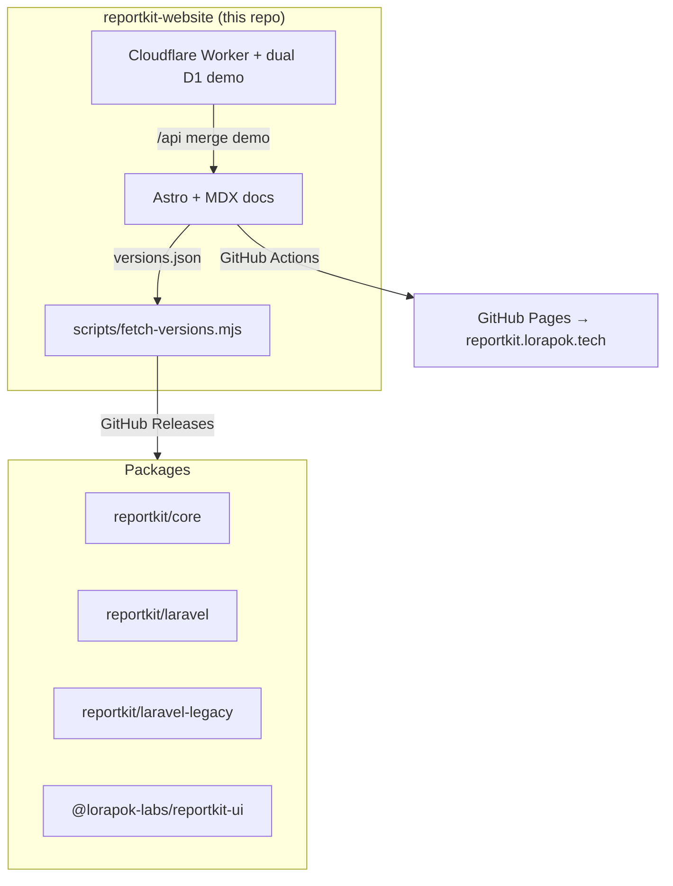

<p align="center">
  
</p>

<h1 align="center">ReportKit — Website &amp; Docs</h1>

<p align="center"><strong>The product site and Bootstrap-style documentation portal for ReportKit.</strong></p>

<p align="center">
  <a href="https://reportkit.lorapok.tech"></a>
  <a href="https://github.com/Maijied/Reportkit-Core/actions/workflows/deploy-site.yml"></a>
  
  <a href="LICENSE"></a>
</p>

<p align="center">
  <a href="https://reportkit.lorapok.tech">Home</a> ·
  <a href="https://reportkit.lorapok.tech/docs">Docs</a> ·
  <a href="https://reportkit.lorapok.tech/showcase">Showcase</a> ·
  <a href="./SETUP-DNS.md">DNS &amp; secrets</a> ·
  <a href="./VERSIONING.md">Versioning</a>
</p>

> **Part of the Lorapok Labs ecosystem.** Marketing site + full documentation for [ReportKit](https://github.com/Maijied/Reportkit-Core), plus the live multi-database demo.

---

## Stack

- **Astro 5** (static) + MDX content collection for docs
- **Bootstrap 5.3** SCSS themed with `$primary: #0b7a4b`
- **Pagefind** full-text docs search
- Live package versions pulled at build time via `scripts/fetch-versions.mjs`
- Optional **Cloudflare Worker + dual D1** demo API (`worker/`)

## How it all connects



## Develop

```bash
npm install
npm run dev
```

```bash
npm run build   # sync-docs + fetch-versions + astro build + ensure dist/CNAME
```

## Deploy

GitHub Actions → Pages (`deploy-site.yml`). Rebuilds on push and on package `release` events so version badges stay live. See [SETUP-DNS.md](./SETUP-DNS.md) for DNS + Cloudflare secrets and [VERSIONING.md](./VERSIONING.md) for the release channels.

## Ecosystem

| Package | Role |
|---------|------|
| [`reportkit/core`](https://github.com/Maijied/Reportkit-Core/tree/main/reportkit-core) | PHP engine (5.6 → 8.5) |
| [`reportkit/laravel`](https://github.com/Maijied/Reportkit-Core/tree/main/reportkit-laravel) | Laravel 5.5 → 12 / 13 |
| [`reportkit/laravel-legacy`](https://github.com/Maijied/Reportkit-Core/tree/main/reportkit-laravel-legacy) | Laravel 4.1 – 5.4 |
| [`@lorapok-labs/reportkit-ui`](https://github.com/Maijied/Reportkit-Core/tree/main/reportkit-ui) | Browser CSS/JS |

## Author

**Mohammad Maizied Hasan Majumder** (Maijied) · Senior Software Engineer @ **Shohoz Ltd** · Founder and Principal Engineer @ **Lorapok Labs**  
Dhaka, Bangladesh · [mdshuvo40@gmail.com](mailto:mdshuvo40@gmail.com) · [GitHub @Maijied](https://github.com/Maijied)

Full profile: [AUTHORS.md](../AUTHORS.md)

## License

MIT © Mohammad Maizied Hasan Majumder / Lorapok Labs
