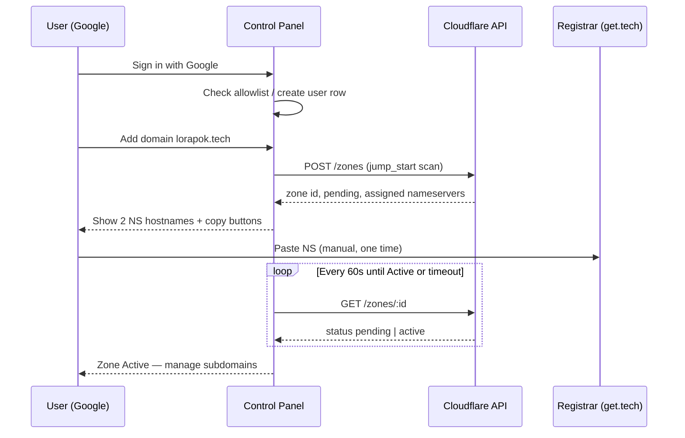

# Domain Control Panel — build instructions

**Status:** Planning doc only — not implemented yet.

**Goal:** Build a Lorapok Labs web app where an authenticated user (Sign in with Google) can onboard domains, manage subdomains, attach Workers, and verify DNS/SSL — replacing the manual steps in [SETUP-DNS.md](../SETUP-DNS.md).

**Reference implementation (manual, done today):**

| Step | Manual today | Automate later |
|------|--------------|----------------|
| Registrar nameservers → Cloudflare | get.tech dashboard | Semi-auto (show NS + poll until Active) |
| Cloudflare zone onboarding | Cloudflare dashboard | **Full API** |
| GitHub Pages subdomain | Cloudflare DNS CNAME | **Full API** |
| Worker custom domain (`api.reportkit`) | Workers → Domains | **Full API** |
| Health / SSL checks | `curl`, dashboard | **Full API + UI status** |

---

## 1. Product scope

### In scope (v1)

- **Sign in with Google** — only allowlisted Google accounts (Lorapok team + invited users).
- **Domain list** — domains the user owns or manages (starting with `lorapok.tech`).
- **Cloudflare connect** — store a per-account or org Cloudflare API token; validate permissions.
- **Subdomain CRUD** — create/update/delete subdomains using predefined **templates**:
  - **GitHub Pages site** — CNAME `{name}` → `{github-user}.github.io`, proxy **DNS only** (grey cloud).
  - **Worker API** — attach `{name}` or `api.{name}` to an existing Worker; proxied; auto TLS.
  - **Plain CNAME / A** — advanced mode for VPS or third-party targets.
- **Status dashboard** — NS propagation, zone Active/Pending, SSL state, `/v1/health` for Worker targets.
- **Audit log** — who changed what subdomain and when.

### Out of scope (v1)

- Buying domains inside the app (keep get.tech / registrar checkout separate).
- Editing Worker **source code** (still repo + GitHub Actions).
- Full get.tech registrar API automation (no stable public API documented; nameserver change stays a one-time manual step at the registrar, guided by the UI).

### Future (v2+)

- Multi-tenant: each Google user connects their own Cloudflare account.
- GitHub OAuth + auto-set GitHub Pages custom domain via GitHub API.
- Email (MX/SPF/DKIM) wizard.
- Terraform/export of DNS as code.

---

## 2. User flows

### Flow A — First-time domain onboarding



### Flow B — Add GitHub Pages subdomain (`reportkit`)

1. User picks template **GitHub Pages**.
2. Enters: subdomain `reportkit`, GitHub Pages target `Maijied.github.io`.
3. App calls Cloudflare DNS API:
   - `POST /zones/:zone_id/dns_records` — type `CNAME`, name `reportkit`, content `maijied.github.io`, `proxied: false`.
4. App shows checklist: “Add custom domain in GitHub Pages settings” (link deep-link to repo Pages settings until GitHub API is added in v2).
5. Optional: poll `https://reportkit.lorapok.tech` until 200.

### Flow C — Add Worker API subdomain (`api.reportkit`)

1. User picks template **Cloudflare Worker**.
2. Enters: host `api.reportkit`, Worker name `reportkit-demo-api`, environment `production`.
3. App calls Cloudflare Workers Domains API (or dashboard-equivalent REST):
   - Attach custom hostname to Worker script.
   - Cloudflare creates proxied Worker DNS row automatically.
4. App polls:
   - DNS: `dig api.reportkit.lorapok.tech`
   - TLS: HTTPS GET `{url}/v1/health` until JSON `ok: true` or timeout with “SSL still provisioning”.
5. If site needs the URL: suggest updating `PUBLIC_DEMO_API_URL` in deploy workflow (link to repo file).

### Flow D — Remove subdomain

1. Confirm dialog with hostname.
2. Delete Worker custom domain **or** DNS record (depending on template).
3. Write audit log entry.

---

## 3. Recommended architecture

Align with the existing ReportKit stack (Cloudflare Worker + D1 + static site).

```
┌─────────────────────────────────────────────────────────────┐
│  control.lorapok.tech  (Astro static site on GitHub Pages)   │
│  - Google Sign-In button (OAuth redirect)                    │
│  - Dashboard UI (subdomains, status, onboarding wizard)      │
└───────────────────────────┬─────────────────────────────────┘
                            │ HTTPS + session cookie / Bearer
                            ▼
┌─────────────────────────────────────────────────────────────┐
│  lorapok-control-api  (Cloudflare Worker)                    │
│  - /auth/google, /auth/callback, /auth/logout                │
│  - /v1/domains, /v1/domains/:id/subdomains                   │
│  - /v1/domains/:id/status (NS, SSL, health)                  │
│  - Service: CloudflareClient (uses stored token)             │
└───────────────┬─────────────────────────────┬─────────────────┘
                │                             │
                ▼                             ▼
         D1: control_panel              Cloudflare API
         (users, domains,               (zones, dns, workers)
          subdomains, audit)
```

### Why separate Worker from `reportkit-demo-api`

- Demo API is public and CORS-locked to `reportkit.lorapok.tech`.
- Control panel needs **authenticated admin** routes and encrypted secrets — keep it isolated.

### Suggested repo layout (when building)

```
reportkit-website/
  control-panel/          # Astro app (new)
    src/pages/
      index.astro         # login
      dashboard.astro     # domain list
      domains/[id].astro  # subdomain manager
  worker-control/         # Admin Worker (new)
    src/
      auth/google.ts
      routes/domains.ts
      routes/subdomains.ts
      services/cloudflare.ts
    schema/control.sql
    wrangler.toml
  docs/
    DOMAIN-CONTROL-PANEL-INSTRUCTIONS.md   # this file
```

Host the UI at e.g. **`control.lorapok.tech`** (CNAME → GitHub Pages, DNS only).

---

## 4. Sign in with Google

### 4.1 Google Cloud setup

1. [Google Cloud Console](https://console.cloud.google.com/) → project **Lorapok Control Panel**.
2. **APIs & Services → OAuth consent screen** — External or Internal (Workspace).
3. **Credentials → Create OAuth client ID** — type **Web application**.
4. Authorized JavaScript origins:
   - `https://control.lorapok.tech`
   - `http://localhost:4321` (local Astro dev)
5. Authorized redirect URIs:
   - `https://api.control.lorapok.tech/auth/google/callback` (Worker)
   - `http://localhost:8787/auth/google/callback` (wrangler dev)

Store in Worker secrets (never in git):

| Secret | Purpose |
|--------|---------|
| `GOOGLE_CLIENT_ID` | OAuth client |
| `GOOGLE_CLIENT_SECRET` | OAuth client |
| `SESSION_SECRET` | Sign session JWT / cookie (32+ random bytes) |
| `ALLOWED_EMAILS` or `ALLOWED_DOMAIN` | e.g. `@gmail.com` allowlist or `lorapok.tech` Google Workspace |

### 4.2 Auth flow (Worker)

1. `GET /auth/google` — redirect to Google with `scope=openid email profile`, `state` CSRF token in HttpOnly cookie.
2. `GET /auth/google/callback` — exchange `code` for tokens; verify `id_token` (aud, iss, exp).
3. Check email against allowlist; upsert user in D1.
4. Issue **HttpOnly Secure SameSite=Lax** session cookie (signed JWT, 7-day TTL, rotate on login).
5. `POST /auth/logout` — clear cookie.

Use **PKCE** if the frontend ever handles the code directly; for server-side Worker callback, standard confidential client is fine.

### 4.3 Authorization rules

| Action | Rule |
|--------|------|
| View domain | User is owner **or** member of domain’s team |
| Change DNS | Owner or `admin` role |
| Connect Cloudflare token | Owner only |
| View audit log | Owner + admin |

Start simple: single owner per domain, hardcoded allowlist of Google emails in env.

---

## 5. Cloudflare API automation

Use the same permission model as CI (see [SETUP-DNS.md](../SETUP-DNS.md)):

| Permission | Needed for |
|------------|------------|
| Account → Workers Scripts → Edit | Attach Worker custom domains |
| Account → D1 → Edit | (optional) if control panel uses D1 on same account |
| Zone → DNS → Edit | Create CNAME/A records |
| Zone → Zone → Read | Poll zone status |
| Account → Account Settings → Read | Validate token |

Token storage: encrypt at rest in D1 with a key from Worker secret `TOKEN_ENCRYPTION_KEY` (AES-GCM). Never return full token to the browser after save.

### 5.1 Onboard zone

```http
POST https://api.cloudflare.com/client/v4/zones
Authorization: Bearer {token}
Content-Type: application/json

{
  "name": "lorapok.tech",
  "type": "full",
  "jump_start": true
}
```

Save `result.id`, `result.name_servers`, `result.status`. Poll `GET /zones/:id` until `status === "active"`.

### 5.2 GitHub Pages CNAME

```http
POST https://api.cloudflare.com/client/v4/zones/{zone_id}/dns_records
{
  "type": "CNAME",
  "name": "reportkit",
  "content": "maijied.github.io",
  "proxied": false,
  "comment": "control-panel: github-pages reportkit"
}
```

**Rule:** GitHub Pages targets → always `proxied: false` (grey cloud).

### 5.3 Worker custom domain

Prefer the Workers **Custom Domains** API (exact path varies by API version — use Cloudflare docs at build time):

1. Resolve Worker script name → service id.
2. `POST` attach hostname `api.reportkit.lorapok.tech` to environment `production`.
3. Confirm DNS row type `Worker` appears in zone records.

Fallback if API is awkward: create route `{hostname}/*` via Workers Routes API (less ideal than Custom Domains).

### 5.4 Status checks (implement as `/v1/domains/:id/status`)

| Check | Method |
|-------|--------|
| Nameservers | `GET /zones/:id` → compare `name_servers` |
| DNS record exists | `GET /zones/:id/dns_records?name=...` |
| SSL ready | `fetch(https://host)` — success if TLS completes |
| Worker health | `GET https://{host}/v1/health` → parse JSON `.ok` |
| External NS | optional `dns.google` DoH query from Worker |

Return a unified JSON status object for the UI:

```json
{
  "domain": "lorapok.tech",
  "zone_status": "active",
  "subdomains": [
    {
      "host": "api.reportkit.lorapok.tech",
      "template": "worker",
      "dns": "ok",
      "ssl": "provisioning",
      "health": "unknown"
    }
  ]
}
```

---

## 6. Registrar step (get.tech) — guided manual

The app **cannot** reliably change get.tech nameservers via API today. The onboarding wizard must:

1. Display Cloudflare’s two NS hostnames with **Copy** buttons.
2. Show deep link: `https://manage.get.tech/dashboard/` → Manage → DNS → Nameservers.
3. Warn: disable DNSSEC at registrar before changing NS.
4. Explain: legacy DNS rows at get.tech are ignored after migration.
5. Poll Cloudflare until zone Active; then enable subdomain features.

Optional enhancement: user uploads a screenshot; admin marks step complete (no OCR required for v1).

---

## 7. D1 schema (sketch)

```sql
-- worker-control/schema/control.sql

CREATE TABLE users (
  id TEXT PRIMARY KEY,              -- Google sub
  email TEXT NOT NULL UNIQUE,
  name TEXT,
  picture_url TEXT,
  created_at TEXT NOT NULL,
  last_login_at TEXT
);

CREATE TABLE cloudflare_accounts (
  id TEXT PRIMARY KEY,
  owner_user_id TEXT NOT NULL REFERENCES users(id),
  account_id TEXT NOT NULL,         -- Cloudflare account UUID
  token_ciphertext TEXT NOT NULL,   -- encrypted API token
  token_hint TEXT,                  -- last 4 chars for UI
  created_at TEXT NOT NULL
);

CREATE TABLE domains (
  id TEXT PRIMARY KEY,
  owner_user_id TEXT NOT NULL REFERENCES users(id),
  cf_account_id TEXT NOT NULL REFERENCES cloudflare_accounts(id),
  zone_id TEXT NOT NULL,
  zone_name TEXT NOT NULL UNIQUE,
  registrar TEXT,                   -- e.g. get.tech
  zone_status TEXT NOT NULL,        -- pending | active | moved | deleted
  created_at TEXT NOT NULL
);

CREATE TABLE subdomains (
  id TEXT PRIMARY KEY,
  domain_id TEXT NOT NULL REFERENCES domains(id),
  host TEXT NOT NULL,               -- api.reportkit (relative) or FQDN
  template TEXT NOT NULL,           -- github_pages | worker | cname | a
  config_json TEXT NOT NULL,        -- template-specific fields
  cf_record_id TEXT,                -- DNS record id or worker attachment id
  created_at TEXT NOT NULL,
  updated_at TEXT NOT NULL,
  UNIQUE(domain_id, host)
);

CREATE TABLE audit_log (
  id TEXT PRIMARY KEY,
  user_id TEXT NOT NULL,
  domain_id TEXT,
  action TEXT NOT NULL,
  detail_json TEXT,
  created_at TEXT NOT NULL
);
```

---

## 8. Control Panel HTTP API (Worker)

All `/v1/*` routes require valid session cookie unless noted.

| Method | Path | Description |
|--------|------|-------------|
| GET | `/auth/google` | Start OAuth |
| GET | `/auth/google/callback` | OAuth callback |
| POST | `/auth/logout` | Clear session |
| GET | `/v1/me` | Current user |
| POST | `/v1/cloudflare/connect` | Save encrypted API token + account id |
| GET | `/v1/domains` | List domains for user |
| POST | `/v1/domains` | Onboard zone (`{ "zone_name": "lorapok.tech" }`) |
| GET | `/v1/domains/:id` | Domain detail + NS |
| GET | `/v1/domains/:id/status` | Aggregated health |
| GET | `/v1/domains/:id/subdomains` | List subdomains |
| POST | `/v1/domains/:id/subdomains` | Create from template |
| PATCH | `/v1/domains/:id/subdomains/:sid` | Update target / proxied |
| DELETE | `/v1/domains/:id/subdomains/:sid` | Remove record + Worker attach |
| GET | `/v1/domains/:id/audit` | Audit log |

Request example — create Worker subdomain:

```json
POST /v1/domains/{domain_id}/subdomains
{
  "template": "worker",
  "host": "api.reportkit",
  "worker_name": "reportkit-demo-api",
  "environment": "production",
  "health_path": "/v1/health"
}
```

---

## 9. UI pages (Astro)

| Page | Purpose |
|------|---------|
| `/` | Marketing blurb + **Sign in with Google** |
| `/dashboard` | Domain cards, “Add domain”, connection status |
| `/domains/new` | Wizard: enter zone name → Cloudflare onboard → show NS |
| `/domains/[id]` | Tabs: Overview, Subdomains, DNS status, Audit |
| `/domains/[id]/subdomains/new` | Template picker + form |
| `/settings` | Cloudflare token connect/disconnect, session info |

Use `@lorapok-labs/reportkit-ui` components where possible for visual consistency with ReportKit.

---

## 10. Subdomain templates (config reference)

### Template: `github_pages`

```json
{
  "host": "reportkit",
  "github_target": "maijied.github.io",
  "proxied": false,
  "github_repo": "Maijied/Reportkit-Core",
  "pages_custom_domain": "reportkit.lorapok.tech"
}
```

### Template: `worker`

```json
{
  "host": "api.reportkit",
  "worker_name": "reportkit-demo-api",
  "environment": "production",
  "proxied": true,
  "health_path": "/v1/health"
}
```

### Template: `cname`

```json
{
  "host": "www",
  "target": "lorapok.github.io",
  "proxied": true
}
```

### Template: `a`

```json
{
  "host": "app",
  "ipv4": "203.0.113.10",
  "proxied": false
}
```

---

## 11. Security checklist

- [ ] Google OAuth with allowlisted emails only (no public signup).
- [ ] HttpOnly + Secure + SameSite cookies; no tokens in `localStorage`.
- [ ] Cloudflare API token encrypted in D1; scoped minimum permissions.
- [ ] CSRF `state` on OAuth; CSRF token on mutating forms.
- [ ] Rate-limit `/auth/*` and subdomain mutations per IP/user.
- [ ] CORS: control UI origin only (`https://control.lorapok.tech`).
- [ ] Audit every DNS/Worker change with `user_id` + timestamp.
- [ ] Never log API tokens or Google `id_token`.
- [ ] Separate Worker from public demo API (`reportkit-demo-api`).
- [ ] Rotate `SESSION_SECRET` and encryption key via Wrangler secrets update runbook.

---

## 12. Implementation phases

### Phase 0 — Docs & secrets (now)

- [x] Manual runbook: [SETUP-DNS.md](../SETUP-DNS.md)
- [x] This instructions file
- [ ] Create Google OAuth client (when development starts)
- [ ] Create `lorapok-control-api` Worker + D1 in Cloudflare dashboard

### Phase 1 — Auth shell

- Astro site + Google login/logout
- Worker session + `/v1/me`
- Deploy to `control.lorapok.tech`

### Phase 2 — Cloudflare connect + zone onboard

- Save token (encrypted)
- Add zone + NS display + poll until Active

### Phase 3 — Subdomain templates

- GitHub Pages CNAME CRUD
- Worker custom domain attach/detach
- Status polling UI

### Phase 4 — Polish

- Audit log UI
- Email notifications on failure (optional)
- GitHub Pages API integration (auto-set custom domain)

---

## 13. Mapping from today’s manual setup

Use this table when implementing templates so the app reproduces what we did for ReportKit:

| Host | Template | Target / Worker | Proxy | Notes |
|------|----------|-----------------|-------|-------|
| `reportkit` | github_pages | `maijied.github.io` | DNS only | Site demo |
| `api.reportkit` | worker | `reportkit-demo-api` | Proxied | Demo API |
| `ai` | github_pages | `maijied.github.io` | Proxied* | *Prefer DNS only for github.io |
| `atlas` | github_pages | `maijied.github.io` | DNS only | |
| `querycraft` | github_pages | `maijied.github.io` | DNS only | |
| `www` | cname | `lorapok.github.io` | Proxied | |
| apex `lorapok.tech` | a (×4) | GitHub Pages IPs | Proxied | Import only; rarely created via app |

**Registrar (get.tech):** NS = `mariah.ns.cloudflare.com`, `rory.ns.cloudflare.com`; DNSSEC off.

---

## 14. Verification script (for CI / manual QA)

After the control panel creates a subdomain, run:

```bash
# Zone active
curl -s -H "Authorization: Bearer $CF_TOKEN" \
  "https://api.cloudflare.com/client/v4/zones?name=lorapok.tech" | jq '.result[0].status'

# DNS record
dig +short reportkit.lorapok.tech CNAME

# Worker health
curl -s "https://api.reportkit.lorapok.tech/v1/health" | jq '.ok'
```

Add a GitHub Actions workflow `control-panel-e2e.yml` later that hits the Worker API with a test token against a staging zone.

---

## 15. Related docs

- [SETUP-DNS.md](../SETUP-DNS.md) — current manual DNS + Cloudflare + Worker steps
- [RESEARCH.md](./RESEARCH.md) — ReportKit demo data model (unchanged by control panel)
- [Cloudflare API docs](https://developers.cloudflare.com/api/)
- [Workers custom domains](https://developers.cloudflare.com/workers/configuration/routing/custom-domains/)
- [Google OAuth 2.0 for web server apps](https://developers.google.com/identity/protocols/oauth2/web-server)

---

## 16. Open questions (decide before coding)

1. **Single org vs multi-tenant** — Lorapok-only first, or any user connects their Cloudflare account?
2. **Host URL** — `control.lorapok.tech` vs subdomain under each managed domain?
3. **GitHub integration priority** — v1 checklist link only, or OAuth in v1?
4. **Who can attach Workers** — restrict to a fixed list of Worker names (`reportkit-demo-api`, …)?

**Recommendation:** Lorapok-only, `control.lorapok.tech`, checklist link for GitHub in v1, allowlist Worker names in v1.
