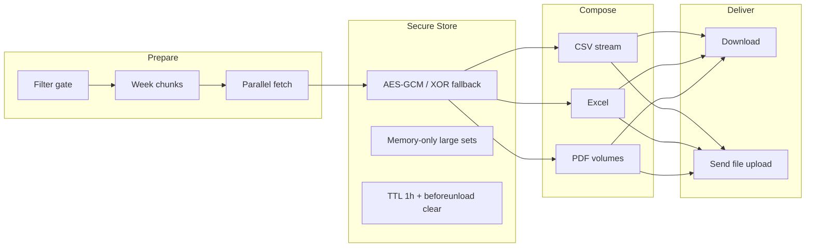

# LLDP — Lorapok Labs Design Pattern

**Prepare → Secure Store → Compose → Deliver (P-S-C-D)**

ReportKit implements LLDP as the reference architecture for reliable reporting against complex, high-volume databases. Host applications own domain SQL and row shaping; ReportKit owns the pipeline, browser store, export composition, and delivery contracts.

## Six invariants

1. **Zero post-prepare SQL** — After prepare completes, exports must not trigger additional database queries.
2. **Partition before parallelize** — Date ranges split into week chunks with bounded concurrency.
3. **Backpressure** — Concurrency limits and chunked compose prevent overload.
4. **Format literacy** — Documented ceilings and fallbacks per export format.
5. **Filter-only invalidation** — Filter changes invalidate prepared data; browse sort/page does not.
6. **Complex joins in host only** — Multi-table logic stays in host `RowSource`.

## P-S-C-D pipeline

## Scale tiers (T0–T5)

| Tier | Pattern | When |
|------|---------|------|
| **T0** | Sync browse | Small datasets; server-side DataTables |
| **T1** | Week-chunk prepare | Default async export |
| **T2** | Stream / volume compose | Large CSV/PDF |
| **T3** | Dual-DB merge | Host merges in `RowSource` |
| **T4** | Warehouse strangler | Read replica / OLAP |
| **T5** | Synthetic demo | Docs and benchmarks |

## Browser secure store

AES-GCM 256 when Web Crypto is available; XOR-B64 fallback otherwise. Keys in RAM only. Payloads under ~1.5 MB may use `sessionStorage`; larger sets stay memory-only. Cleared on `beforeunload`, new prepare, and 1-hour TTL.

## Send contract

LLDP Deliver validates **file before email** using multipart field `file` (not `report_file`).

## JavaScript load order

jQuery → `lldp-core.js` → `reportkit.js`

When `store.encryption_enabled` is true (default), `ReportKit.initSecureStore()` wires the encrypted store automatically.

## See also

- [Architecture](/docs/0.1/core/architecture)
- [Week chunking](/docs/0.1/core/week-chunking)
- [Export overview](/docs/0.1/export/overview)
